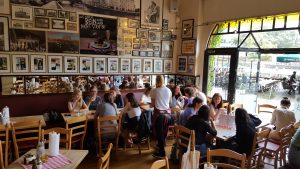
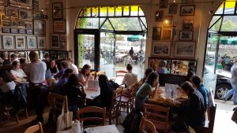
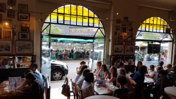
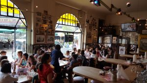
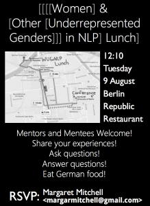

Bonnie Webber noticed something odd -- she was not seeing many women presenting.  She asked around and made some back-of-the-envelope calculations to estimate that there was a reasonable chance that a student to go through the entire conference seeing 1 or less women presenting.  This kind of imbalance in who is seen presenting work can lead to self-reinforcing preconceptions (among everyone) about what researchers look like.

Margaret Mitchell had come to ACL 2016 last-minute, with one main purpose: Host a lunch for women and underrepresented genders. She had been measuring the changes in gender representation in ACL among those who had authored papers. Reasoning that conferences might have an effect on retention, she organized the [WUGiNLP Lunch](#lunch) to be held at ACL.

After ACL, Bonnie emailed Margaret, ACL Session Chairs, and members of the ACL Executive Board to discuss representation, leading to the formation of the Women in NLP board.

The board hosted a meeting at EMNLP 2016, and it was decided: There would be a workshop focusing on representational issues, organized by [Libby Barak](http://libbybarak.wordpress.com), [Isabelle Augenstein](http://isabelleaugenstein.github.io/), [Chloé Braud](https://chloebt.github.io/), [He He](http://www.umiacs.umd.edu/~hhe/), and [Margaret Mitchell](http://www.m-mitchell.com/).

 

## WUGiNLP Lunch @ ACL 2016

A precursor to the Women and Underrepresented Minorities group was the WUGiNLP Lunch, sponsored by Microsoft Research.

WUGiNLP stands for "Women and other Underrepresented Genders in NLP", and the first Lunch took place on 9.August, at ACL 2016 in Berlin, organized by WiNLP co-organizer Margaret Mitchell.

This lunch paired mentors with mentees to have an informal discussion about work, research, and additional barriers facing underrepresented genders in NLP.

The event was such a success, we decided to take this to the next level for ACL 2017:  [The WiNLP Workshop](http://www.winlp.org/winlp-workshop/).

#### Pictures: The first Women and other Underrepresented Minorities in NLP Lunch, 9.Aug.2016, Berlin, ACL

        

        

#### Advertisement: The first Women and other Underrepresented Minorities in NLP Lunch, 9.Aug.2016, Berlin, ACL

        [![E-mail, reading: ACL 2016: Tuesday August 9th, Die Berliner Republik Restaurant, 12:10. WUGiNLP Lunch. If you are here, would you be interested in joining lunch for Women and other Underrepresented Genders, on Tuesday? If so, would you want to come as a mentor (if you've completed your PhD) or a mentee? If you choose to come as a mentor, your role would be to sit with 1-2 people at lunch, so that they could ask you questions and you could give advice, and otherwise share your experiences in STEM. If you choose to come as a mentee, your role would be to be one of the 1-2 people asking questions. =) If you are interested, please let me know any suggestions of particular women or other underrepresented folk you would like to either: (1) Invite (2) Sit with at lunch Thanks!!](images/wuginlp_email-229x300.png)](http://www.winlp.org/wp-content/uploads/2017/03/wuginlp_email.png)

 

 

 

 

 

 

 

 

 

 

Flyer designed and distributed by [Hal](https://www.umiacs.umd.edu/~hal/)!
