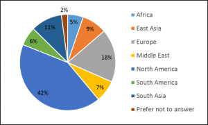

### The first WiNLP workshop was co-located with ACL 2017 in Vancouver.

* * *

##### We are pleased to announce that we received **95 submissions**! Thank you all for this massive participation!

Moreover, 94% of the submissions are by female authors, and by authors from a large variety of countries, see the chart below.

### Program:

**Invited speakers** include [Pascale Fung](http://www.ee.ust.hk/~pascale/), [Ndapa Nakashole](http://nakashole.com/), [Bonnie Webber](http://homepages.inf.ed.ac.uk/bonnie/)!

The workshop aims at highlighting research done by women and other underrepresented minorities, providing a supportive venue for junior members, and offering opportunities for networking and career discussion.

The event will consist of:

1. Invited Talks from leading women in NLP
2. Contributed oral talks and posters showcasing the wide diversity of work coming from women and other underrepresented minorities in NLP
3. Discussions
4. Recruitment/General mentoring Lunch
5. Individual mentoring

It is a great opportunity for everyone to come and learn more about the contributions of women and other underrepresented minorities in NLP.

* * *

WiNLP adheres to the ACL [anti-harassment policy](https://www.aclweb.org/adminwiki/index.php?title=Anti-Harassment_Polic), if you have concerns, please contact [winlp-chairs@googlegroups.com](mailto:winlp-chairs@googlegroups.com).
