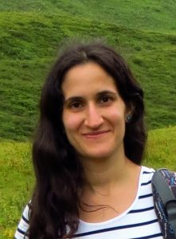
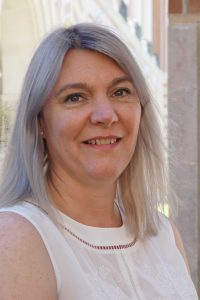
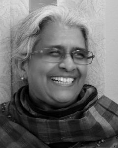
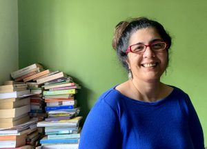

### The first WiNLP Satellite Workshop will be held in conjunction with [AACL-IJCNLP 2020](http://aacl2020.org/) and will be **100% Online**, organized by Widening NLP in collaboration with the Diversity and Inclusion committee.

The first satellite workshop will focus on diversity in the Asia-Pacific region, and will take place on **December 4th**.

- **Date:** December 4, 2020
- **Time:** 9:00 - 12:00 (China Standard Time)

The 3-hour event will include a mentoring session, a panel discussion with a special focus in issues related to diversity and inclusion, and a networking and social hour. The workshop provides an excellent opportunity for junior members in the community to connect with senior mentors for feedback and career advice, and for all members of the community to come together and discuss diversity efforts and issues.

The event will be open to all. If you are interested, please **register following this** **[registration link](https://winlp.ling.washington.edu/survey/index.php/545173?lang=en)**.

## Schedule

**In China Standard Time on December 4th at AACL-IJCNLP 20209:00 - 9:05: Welcoming Participants** **9:10 - 9:55: Mentorship Session**  **10:00 - 11:00: Panel Discussion** **11:00 - 11:05: Closing and Vote of Thanks, Announcements** **11:05 - 12:00: Virtual Social Hour**

## Panel

Widening NLP will host a panel of female-identifying experts from around the Asia region to discuss their experiences in the field and share reflections on diversity and inclusion in NLP for underrepresented researchers and allies. Panelist information:

- **Dr Kalika Bali - Principal Researcher, Microsoft Research, India ([https://www.microsoft.com/en-us/research/people/kalikab/](https://www.microsoft.com/en-us/research/people/kalikab/))** Dr. Kalika Bali is a Principal Researcher at Microsoft Research India working broadly in the area of Speech and Language Technology especially technology for Low Resource Languages. She believes that local language technology especially with speech interfaces, can help millions of people gain entry into a world that is till now almost inaccessible to them.
    
- **Ms. Hila Gonen - PhD student at Bar Ilan University, Israel ([https://u.cs.biu.ac.il/~gonenhi/](https://u.cs.biu.ac.il/~gonenhi/))** Hila is a PhD student at Bar Ilan University (graduating soon) in the field of Natural Language Processing and Deep Learning, under the supervision of Dr. Yoav Goldberg, recently started a postdoc position at Amazon. Prior to that, she obtained her M.Sc in Computer Science from the Hebrew University, under the supervision of Prof. Orna Kupferman. She is fascinated by languages and interested in relations between different languages and the way multilingual signals can be used for various tasks. She is also focusing on research in the area of gender bias in NLP.
    
- **Prof Karin Verspoor - Professor in Computing and Information Systems, University of Melbourne, Australia ([https://findanexpert.unimelb.edu.au/profile/458973-karin-verspoor](https://findanexpert.unimelb.edu.au/profile/458973-karin-verspoor))** Karin Verspoor is a Professor in the School of Computing and Information Systems at the University of Melbourne. She is an expert in text mining of scientific publications and natural language processing of clinical texts, as well as ontology- and knowledge-based methods for biomedical data analysis.
    
- **Prof Hema Murthy - Professor, IIT Madras ([https://www.cse.iitm.ac.in/~hema/](https://www.cse.iitm.ac.in/~hema/))** Biodata: Faculty at IITM for 32 years.   PhD IITM, Masters by Research -- McMaster University, Canada, B E -- Osmania University, Hyderabad. Focus of research: Signal Processing and Machine Learning, Areas (Current): Speech Technology, Computational Brain Research, Music Processing. Areas (earlier): Computer Graphics, Networks, Text. Projects (Current): Speech to Speech   (PI for speech effort).  Have done a large number of projects. Awards: INAE Fellow (2017), IBM Faculty Award (2006), Shastra and GE innovation award (2012) -- text to speech synthesis in Indian languages.
    

 

\[caption id="attachment\_2479" align="alignleft" width="221"\] Hila Gonen\[/caption\]

\[caption id="attachment\_2480" align="alignleft" width="200"\] Karin Verspoor\[/caption\]

\[caption id="attachment\_2482" align="alignleft" width="240"\] Hema Murti\[/caption\]

\[caption id="attachment\_2481" align="alignleft" width="300"\] Kalika Bali\[/caption\]
