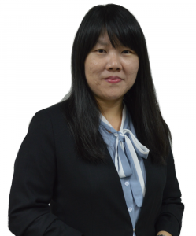

### The WiNLP Satellite Workshop will be held in conjunction with [ACL-IJCNLP](https://2021.aclweb.org/) and will be **100% Online**, organized by Widening NLP.

The workshop will focus on sharing experiences of researchers from diverse backgrounds in the Asia region, and will take place on **August 1st**. The event will be free and open to all. [Register here.](https://www.eventbrite.com/e/acl-winlp-mini-workshop-registration-157656736543)

- **Date:** August 1st, 2021
- **Time:  5:30 AM -7:45 AM GMT/UTC**

**Schedule:**

- **5:30 AM - 5:35 AM: Welcome**
- **5:35 AM - 6:50 AM: Panel on NLP in the time of Corona: Stories from Asia**
- **6:50 AM - 7:00 AM: Break**
- **7:00 AM - 7:45 AM: Collaborative Tutorial**

* * *

**5:35 AM UTC:  Panel on NLP in the time of Corona: Stories from Asia**

The pandemic has hit women and gender-diverse people in every industry especially hard, resulting in significant drops in presence in the workplace and challenging those remaining in the workforce in unprecedented ways, as societies grapple with the mental, social, emotional, and logistic ramifications of living through a pandemic. The NLP research community, in academia and industry, is no exception to this. At the same time, changes in how we handle remote life — both for conferences and day-to-day research and teaching — along with adaptations that we have made individually, can impact our field for the better. In this panel, we talk with women and gender-diverse NLP researchers from throughout Asia about what challenges they have faced, how they have adapted, and what lessons we can take moving forward to create a more inclusive and accessible research community around the world.

Speakers:

**Akiko Aizawa**

Dr. Aizawa is a professor at National Institute of Informatics, Japan ([https://www.nii.ac.jp/en/](https://nam10.safelinks.protection.outlook.com/?url=https%3A%2F%2Fwww.nii.ac.jp%2Fen%2F&data=04%7C01%7Chlepp%40ets.org%7C9b53c60b2c8f41890b6c08d937cd287c%7C0ba6e9b760b34fae92f37e6ddd9e9b65%7C0%7C0%7C637602176567326632%7CUnknown%7CTWFpbGZsb3d8eyJWIjoiMC4wLjAwMDAiLCJQIjoiV2luMzIiLCJBTiI6Ik1haWwiLCJXVCI6Mn0%3D%7C1000&sdata=9jonyeTwE2LQcbpwmlanESMGEtQd65DS1q6ovbaCXEo%3D&reserved=0)). Dr. Aizawa works on natural language understanding, dialogue systems, and scientific document analysis.

**Prathyusha Jwalapuram**

She is a PhD student at Nanyang Technological University, Singapore. Her work is focused on discourse-level evaluation of machine translation. She has served as one of the student chairs of the Diversity & Inclusion committee of both EMNLP 2020 and NAACL 2021. While she was a Master’s student at IIIT-Hyderabad, she co-organized a workshop called Women Scientists in NLP as part of the ICON conference, which aimed to highlight the disparate experiences of women in research.

**Soon Lay Ki** 

Dr. Soon graduated with a Ph.D (Engineering) in Web Engineering from Soongsil University, Korea in 2009. Her main research interests include text mining and natural language processing, particularly on processing texts in Malaysian contexts.   She is also involved in projects related to database integration and data warehousing for health data.  She was a Senior Lecturer at Faculty of Computing and Informatics (FCI), Multimedia University and the Deputy Dean (Research and Innovation) of FCI from March 2016 to August 2018.  She joined the School of Information Technology, Monash University Malaysia in September 2018.  To date, she has graduated seven Ph.D and two Master students. She is currently supervising four PhD students and two Master students.  Dr. Soon was a Research Fellow in Telekom Malaysia R&D on a database optimisation project. Besides teaching in university, she has also conducted courses on Relational Database and NoSQL Database to corporate employees.

* * *

**7:00 AM UTC:  Collaborative Tutorial**

**The Productivity Toolbox:** This 45-minute workshop will be an opportunity to talk about the tools and strategies we use as researchers to plan and sustain our projects. We'll talk specifically about how we organize things like managing a codebase, organizing references and literature review, and getting experiments up and running when you don't have a lot of computing resources. While we'll offer a few ideas, we're also interested in gathering your feedback, with the goal to gather this information into a page on the ACL Wiki for future use!

* * *

The WiNLP Workshop provides an excellent opportunity for junior and senior members of the community to connect with each other, and discuss diversity efforts and issues.
