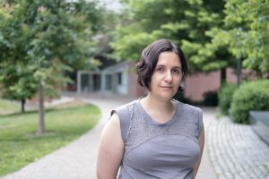
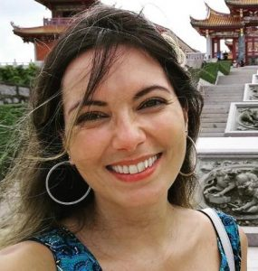
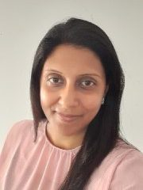
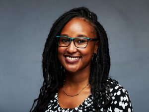
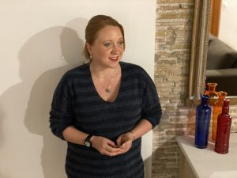
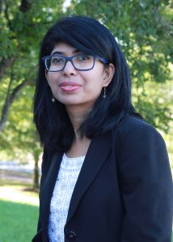

### Our two-hour panel “NLP in the Time of Corona: Adaptations and Lessons for Women and Allies” will be held in conjunction with NAACL and will be **free and online**, organized by Widening NLP.

The panel will take place on **Wednesday, June 9th from 1-3 PM GMT. The event is open to all.**

**Register here: [Eventbrite Page](https://www.eventbrite.com/e/naacl-winlp-panel-nlp-women-in-the-time-of-corona-registration-154296146929)**

In preparation for joining this event, please review our **Zoom Code of Conduct, located here:** [WiNLP Guidelines for Zoom Moderation](http://www.winlp.org/winlp-guidelines-for-zoom-moderation/)

The pandemic has hit women and gender-diverse people in every industry especially hard, resulting in significant drops in presence in the workplace and challenging those remaining in the workforce in unprecedented ways, as societies grapple with the mental, social, emotional, and logistic ramifications of living through a pandemic. The NLP research community, in academia and industry, is no exception to this. At the same time, changes in how we handle remote life -- both for conferences and day-to-day research and teaching -- along with adaptations that we have made individually, can impact our field for the better. In this panel, we talk with women and gender-diverse NLP researchers at various stages of career growth about what challenges they have faced, how they have adapted, and what lessons we can take moving forward to create a more inclusive and accessible research community around the world.

#### Panel

We are excited to host a panel of NLP experts from industry and academia to discuss their experiences as women and gender-diverse researchers during the pandemic, and reflect on ways to capture inclusive adaptations to the field moving forward. Our panel will be moderated by Dr. Surangika Ranathunga of University of Moratuwa, one of our WiNLP workshop organizers.

**Libby Barak**

Libby Barak is a postdoctoral associate in the department of Mathematics and Computer Science at Rutgers University - Newark. She completed her M.Sc. at Bar-Ilan University working on text classification and earned her Ph.D. from the University of Toronto while working on models of verb acquisition. Dr. Barak then spent two years as a post-doc in the Psychology department at Princeton University working with Adele Goldberg exploring models of language learning. Dr. Barak's research interests are in the areas of cognitive modeling of language and learning. Dr. Barak's goal is to create computational models that simulate plausible representations of the learner and the input by accounting for theoretical findings from experimental observations on human behavior. By using this modeling approach, Dr. Barak aims to clarify how learning and linguistic factors interact to facilitate the rapid pace of natural language learning and how learning may vary given individual differences among learners.

**Rossana Cunha**

Rossana Cunha is a PhD Candidate at the Federal University of Minas Gerais ([UFMG](https://nam10.safelinks.protection.outlook.com/?url=https%3A%2F%2Fufmg.br%2F&data=04%7C01%7CHLEPP%40ets.org%7Cccb5596440f2469b57b108d91742e8db%7C0ba6e9b760b34fae92f37e6ddd9e9b65%7C0%7C0%7C637566399354130726%7CUnknown%7CTWFpbGZsb3d8eyJWIjoiMC4wLjAwMDAiLCJQIjoiV2luMzIiLCJBTiI6Ik1haWwiLCJXVCI6Mn0%3D%7C1000&sdata=w2eAkJEqndBci7QOU%2Fl276aYIANLtClJNx4eV4zoDcU%3D&reserved=0)). She is also a researcher at the Laboratory for Experimentation in Translation ([LETRA](https://nam10.safelinks.protection.outlook.com/?url=http%3A%2F%2Fletra.letras.ufmg.br%2Fletra%2Fenglish%2Findex.xml&data=04%7C01%7CHLEPP%40ets.org%7Cccb5596440f2469b57b108d91742e8db%7C0ba6e9b760b34fae92f37e6ddd9e9b65%7C0%7C0%7C637566399354130726%7CUnknown%7CTWFpbGZsb3d8eyJWIjoiMC4wLjAwMDAiLCJQIjoiV2luMzIiLCJBTiI6Ik1haWwiLCJXVCI6Mn0%3D%7C1000&sdata=1E83RXhdj3ER2GkcbnWu29a1RMe7e4gc80USYl9Up90%3D&reserved=0)/[UFMG](https://nam10.safelinks.protection.outlook.com/?url=https%3A%2F%2Fufmg.br%2F&data=04%7C01%7CHLEPP%40ets.org%7Cccb5596440f2469b57b108d91742e8db%7C0ba6e9b760b34fae92f37e6ddd9e9b65%7C0%7C0%7C637566399354140722%7CUnknown%7CTWFpbGZsb3d8eyJWIjoiMC4wLjAwMDAiLCJQIjoiV2luMzIiLCJBTiI6Ik1haWwiLCJXVCI6Mn0%3D%7C1000&sdata=P2Po7Dj63EK93X14u1duAFSCee53ZPkx55YQaELHsW4%3D&reserved=0)). Her main areas of interest and research focus on natural language generation, conversational AI, text simplification, and machine translation. She is a WINLP board member and recently joined the [Brasileiras em PLN](https://nam10.safelinks.protection.outlook.com/?url=https%3A%2F%2Fsites.google.com%2Fview%2Fbrasileiras-pln%2F&data=04%7C01%7CHLEPP%40ets.org%7Cccb5596440f2469b57b108d91742e8db%7C0ba6e9b760b34fae92f37e6ddd9e9b65%7C0%7C0%7C637566399354140722%7CUnknown%7CTWFpbGZsb3d8eyJWIjoiMC4wLjAwMDAiLCJQIjoiV2luMzIiLCJBTiI6Ik1haWwiLCJXVCI6Mn0%3D%7C1000&sdata=ukyjKrml9OATfp8kx3JdwYvqu6jynPHdI6b4XlLemjk%3D&reserved=0) group (Brazilian Women in NLP) with the purpose of promoting more diversity in NLP.

**Aloka Fernando**

Aloka Fernando is working as a Research Engineer at the National Languages Processing Center ([NLPC](https://uom.lk/nlp)), at University of Moratuwa (UoM), Sri Lanka. She is currently reading for a MPhil at UoM. Her current research is on Low-Resourced Machine Translation (MT) and also contributes for Resource Development. Prior to the tenure in the research domain, she had been working in the Software Industry for 8 years in diverse capacities.

**Catherine Gitau**

Catherine Gitau is a Data Scientist at [Africa's Talking](https://nam10.safelinks.protection.outlook.com/?url=https%3A%2F%2Fafricastalking.com%2F&data=04%7C01%7CHLEPP%40ets.org%7Cf1c1191a6fcd4eac67c508d9152b7165%7C0ba6e9b760b34fae92f37e6ddd9e9b65%7C0%7C0%7C637564099052934177%7CUnknown%7CTWFpbGZsb3d8eyJWIjoiMC4wLjAwMDAiLCJQIjoiV2luMzIiLCJBTiI6Ik1haWwiLCJXVCI6Mn0%3D%7C3000&sdata=PWoERJ3B793LYP58jKlGPKwMWBZ%2FmcB0d8shsBjQBVQ%3D&reserved=0 "Original URL:
https://africastalking.com/

Click to follow link.") as well as an NLP Engineer at [Proto](https://nam10.safelinks.protection.outlook.com/?url=https%3A%2F%2Fwww.proto.cx%2F&data=04%7C01%7CHLEPP%40ets.org%7Cf1c1191a6fcd4eac67c508d9152b7165%7C0ba6e9b760b34fae92f37e6ddd9e9b65%7C0%7C0%7C637564099052944171%7CUnknown%7CTWFpbGZsb3d8eyJWIjoiMC4wLjAwMDAiLCJQIjoiV2luMzIiLCJBTiI6Ik1haWwiLCJXVCI6Mn0%3D%7C3000&sdata=49ktdpFuuyPcSoqtwOZ6IDQCPbUaSPE4pIPRosllLlw%3D&reserved=0). She has been actively working on a [Machine Translation Platform](https://nam10.safelinks.protection.outlook.com/?url=http%3A%2F%2Ftranslate.masakhane.io%2F&data=04%7C01%7CHLEPP%40ets.org%7Cf1c1191a6fcd4eac67c508d9152b7165%7C0ba6e9b760b34fae92f37e6ddd9e9b65%7C0%7C0%7C637564099052944171%7CUnknown%7CTWFpbGZsb3d8eyJWIjoiMC4wLjAwMDAiLCJQIjoiV2luMzIiLCJBTiI6Ik1haWwiLCJXVCI6Mn0%3D%7C3000&sdata=s5CGjfidoT1FpJ48eTfZ0KMP%2FIqLku6hJlZ9pgTLsMo%3D&reserved=0 "Original URL:
http://translate.masakhane.io/

Click to follow link.") in the last couple of months to finally give machine translation models trained by the [Masakhane](https://nam10.safelinks.protection.outlook.com/?url=https%3A%2F%2Fwww.masakhane.io%2F&data=04%7C01%7CHLEPP%40ets.org%7Cf1c1191a6fcd4eac67c508d9152b7165%7C0ba6e9b760b34fae92f37e6ddd9e9b65%7C0%7C0%7C637564099052954164%7CUnknown%7CTWFpbGZsb3d8eyJWIjoiMC4wLjAwMDAiLCJQIjoiV2luMzIiLCJBTiI6Ik1haWwiLCJXVCI6Mn0%3D%7C3000&sdata=225A%2BdzpN39uFVx%2BZxO%2FoH4wZHEZR0aEzaYXSB2m6WI%3D&reserved=0) community a run in the real world making it possible for the society to contribute to the improvement of the models.

**Margaret Mitchell**

Margaret Mitchell is a researcher working on Ethical AI, currently focused on the ins and outs of ethics-informed AI development in tech. She has published over 50 papers on natural language generation, assistive technology, computer vision, and AI ethics, and holds multiple patents in the areas of conversation generation and sentiment classification. She previously worked at Google AI as a Staff Research Scientist, where she founded and co-led Google's Ethical AI group, focused on foundational AI ethics research and operationalizing AI ethics Google-internally. Before joining Google, she was a researcher at Microsoft Research, focused on computer vision-to-language generation; and was a postdoc at Johns Hopkins, focused on Bayesian modeling and information extraction. She holds a PhD in Computer Science from the University of Aberdeen and a Master's in computational linguistics from the University of Washington. While earning her degrees, she also worked from 2005-2012 on machine learning, neurological disorders, and assistive technology at Oregon Health and Science University. She has spearheaded a number of workshops and initiatives at the intersections of diversity, inclusion, computer science, and ethics. Her work has received awards from Secretary of State Ash Carter and the American Foundation for the Blind, and has been implemented by multiple technology companies. She likes gardening, dogs, and cats.

**Samira Shaikh**

Samira Shaikh is an Assistant Professor in the [Computer Science Department](https://nam10.safelinks.protection.outlook.com/?url=http%3A%2F%2Fcs.uncc.edu%2F&data=04%7C01%7CHLEPP%40ets.org%7C2f9ff55dfed84c48de0c08d9165a7854%7C0ba6e9b760b34fae92f37e6ddd9e9b65%7C0%7C0%7C637565400133216610%7CUnknown%7CTWFpbGZsb3d8eyJWIjoiMC4wLjAwMDAiLCJQIjoiV2luMzIiLCJBTiI6Ik1haWwiLCJXVCI6Mn0%3D%7C1000&sdata=TzkPSxZqJurSDYvPhruGYtg0PdyeGW%2BBUpUhIaXdAEM%3D&reserved=0) in the [College of Computing and Informatics](https://nam10.safelinks.protection.outlook.com/?url=http%3A%2F%2Fcci.uncc.edu%2F&data=04%7C01%7CHLEPP%40ets.org%7C2f9ff55dfed84c48de0c08d9165a7854%7C0ba6e9b760b34fae92f37e6ddd9e9b65%7C0%7C0%7C637565400133216610%7CUnknown%7CTWFpbGZsb3d8eyJWIjoiMC4wLjAwMDAiLCJQIjoiV2luMzIiLCJBTiI6Ik1haWwiLCJXVCI6Mn0%3D%7C1000&sdata=CSJA%2BtJ19yh5p1%2BA3CL0mu4EG17J8t6AnqahyHUl6nM%3D&reserved=0) at the [University of North Carolina - Charlotte](https://nam10.safelinks.protection.outlook.com/?url=http%3A%2F%2Fwww.uncc.edu%2F&data=04%7C01%7CHLEPP%40ets.org%7C2f9ff55dfed84c48de0c08d9165a7854%7C0ba6e9b760b34fae92f37e6ddd9e9b65%7C0%7C0%7C637565400133226609%7CUnknown%7CTWFpbGZsb3d8eyJWIjoiMC4wLjAwMDAiLCJQIjoiV2luMzIiLCJBTiI6Ik1haWwiLCJXVCI6Mn0%3D%7C1000&sdata=gnFUqmPrq4fIFGJW6edY0Vf4FhGqrcn0947I%2B2rDG5g%3D&reserved=0 "Original URL:
http://www.uncc.edu/

Click to follow link.") (UNCC). She has a joint appointment with the [Department of Psychology](https://nam10.safelinks.protection.outlook.com/?url=http%3A%2F%2Fpsych.uncc.edu%2F&data=04%7C01%7CHLEPP%40ets.org%7C2f9ff55dfed84c48de0c08d9165a7854%7C0ba6e9b760b34fae92f37e6ddd9e9b65%7C0%7C0%7C637565400133226609%7CUnknown%7CTWFpbGZsb3d8eyJWIjoiMC4wLjAwMDAiLCJQIjoiV2luMzIiLCJBTiI6Ik1haWwiLCJXVCI6Mn0%3D%7C1000&sdata=u4JGdYdpgcI9dkS4ym5mXt%2FypYqiBvzYezoLK2ff2J8%3D&reserved=0) as an Assistant Professor in Cognitive Science and is an affiliate faculty member of the [School of Data Science](https://nam10.safelinks.protection.outlook.com/?url=https%3A%2F%2Fdatascience.uncc.edu%2F&data=04%7C01%7CHLEPP%40ets.org%7C2f9ff55dfed84c48de0c08d9165a7854%7C0ba6e9b760b34fae92f37e6ddd9e9b65%7C0%7C0%7C637565400133236600%7CUnknown%7CTWFpbGZsb3d8eyJWIjoiMC4wLjAwMDAiLCJQIjoiV2luMzIiLCJBTiI6Ik1haWwiLCJXVCI6Mn0%3D%7C1000&sdata=Mp4OpqT%2FTJf%2B%2BWr7NcVN3zx46M5CW5fVoRZLuYPqmHc%3D&reserved=0). She directs the [SoLID](https://nam10.safelinks.protection.outlook.com/?url=https%3A%2F%2Fwebpages.uncc.edu%2Fsshaikh2%2Fsolid.html&data=04%7C01%7CHLEPP%40ets.org%7C2f9ff55dfed84c48de0c08d9165a7854%7C0ba6e9b760b34fae92f37e6ddd9e9b65%7C0%7C0%7C637565400133236600%7CUnknown%7CTWFpbGZsb3d8eyJWIjoiMC4wLjAwMDAiLCJQIjoiV2luMzIiLCJBTiI6Ik1haWwiLCJXVCI6Mn0%3D%7C1000&sdata=VTQEuht47J1jtKEm2FO2B1a82OA8%2FlPH2YVTEJGJgeg%3D&reserved=0) (Social Language and Intelligent Dialogue Agents) Lab at UNCC, with a focus on Natural Language Generation and Dialogue Systems.
