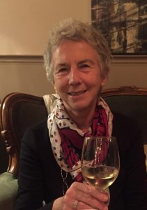
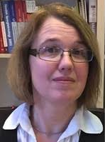
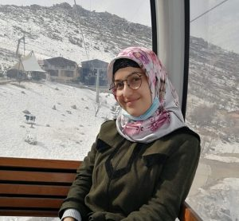

### The WiNLP Satellite Workshop will be held in conjunction with [EACL](https://2021.eacl.org/) and will be **100% Online**, organized by Widening NLP.

The workshop will focus on diversity in the Europe-Africa region, and will take place on **April 19th**.

- **Date:** April 19th, 2021
- **Time:** 5-8 PM GMT

**Agenda (all times in GMT):**

5:00-6:15 PM: Panel on Low Resource Languages and Diversity in NLP Research

6:20-7:25 PM: Writing Workshop

7:25-8:00 PM: Social Event

The workshop provides an excellent opportunity for junior members in the community to connect with senior mentors for feedback and career advice, and for all members of the community to come together and discuss diversity efforts and issues.

The event will be free and open to all. Register here: [https://www.eventbrite.com/e/winlp-mini-workshop-eacl-2021-tickets-145292338295](https://www.eventbrite.com/e/winlp-mini-workshop-eacl-2021-tickets-145292338295)

#### Panel

We are excited to welcome three incredible scholars pushing the boundaries of research on underrepresented languages in NLP.

**Dr. Nicoletta Calzolari Zamorani, Research Associate and former Director of the CNR Institute of Computational Linguistics “A. Zampolli”.**

Honorary Doctorate in Philosophy from the University of Copenhagen, “for her significant contribution to the field of Computational Linguistics”. ACL Fellow, in the founding group, for “significant contributions to computational lexicography, and for the creation and dissemination of language resources”. Honorary President of ELRA (European Language Resources Association_)_ (since 2016), and previously President (2012-16). Permanent Member of the _ICCL._ Member of many committees and boards. She played a central role in building international collaborative projects and platforms for Language Resources and Language Technology, coordinating many international and European projects/strategic initiatives. Co-editor-in-chief of the Journal _Language Resources and Evaluation_, Springer. General Chair of LREC (since 2004), of COLING 2016 and COLING-ACL-2006. More than 400 publications.

See [https://blog.linguistlist.org/fund-drive/featured-linguist-nicoletta-calzolari/](https://blog.linguistlist.org/fund-drive/featured-linguist-nicoletta-calzolari/) for more.

**Prof. ‪Inguna Skadiņa, Tilde Company & Latvijas Universitāte**

Inguna Skadiņa is a professor at Faculty of Computing of University of Latvia (UL). She is also chief scientific officer of language technology company Tilde and senior researcher at the Institute of Mathematics and Computer Science. She has been working for over 30 years on language technologies for less resourced languages. Her current research interests include human-computer interaction and natural language processing in less resourced settings. I.Skadiņa is the national coordinator of CLARIN research infrastructure in Latvia. She has led and participated in many EU (FP5-FP7, ICT PSP, H2020 and CEF) and nationally funded projects related to language technologies. Her current research activities include participation in European Language Equality (ELE) project and scientific coordination of the large-scale national project “Multilingual Artificial Intelligence Based Human Computer Interaction”. I.Skadiņa is the author of more than 70 publications. She is a member of several professional organisations, expert of the Latvian Council of Sciences.

**Ms. Roshna Omer, Info. Management Associate at UNHCR Iraq**

Roshna Omer Abdulrahman is an Information Management Associate at UNHCR. She has published research on Low resource NLP for Kurdish as a part of her master's degree and is continuing research outside of her day job. She has BSc in Computer Science and an MSc in Software Engineering, and over 5 years of software engineering experience. She presented a poster at the WiNLP workshop in 2019. Roshna loves learning languages in her free time.

#### **Writing Tutorial**

As part of the WiNLP satellite event at EACL 2021, we are organizing a beginners' tutorial on writing for academic conferences, with a specific focus on how to write a good extended abstract. Slides can be found [here](http://www.winlp.org/wp-content/uploads/2021/04/winlp-writing-tutorial.pdf).

Note: If you would like to have a complimentary [Grammarly](https://www.grammarly.com/) code for writing assistance, please use this [form](https://forms.office.com/Pages/ResponsePage.aspx?id=DQSIkWdsW0yxEjajBLZtrQAAAAAAAAAAAANAAfe8TVJUNTNBSzlFQzNIWFlPRDhSVlcwVVJSQ1RRTy4u).

Participants for this tutorial should be first time authors (or close to), submitting to conferences and workshops or other academic venues like fellowships in or adjacent to the field of NLP and Computational Linguistics (\*ACL community).

The tutorial will consist of a presentation on the lifecycle of a paper, from writing to publication, and detailed advice on good academic writing, followed by an interactive peer-review-like activity for which participants are invited (but not required) to bring their own extended abstracts or writing drafts they would like feedback from other participants on.

##### **Format**

The first part of the tutorial will cover the “life of a paper,” demystifying conference calls for papers, formatting guidelines and templates, rules like the ACL’s anonymity period, and a number of small things that are often left unsaid: What is an area chair? Is author order important? What is a camera-ready? How do I use a rebuttal? Closing out this half will be a short group-based Q&A.

The second part will zoom in on the writing itself: how do I write a good extended abstract? We will establish and motivate some guidelines for academic writing, from knowing your audience to anticipating common flaws in academic papers. Emphasis will be placed on extended abstracts and how to actually cram all the things you want to say into so small a space (and how not to!), and we will finish up by listing some specific tools like useful LaTeX packages, gotchas like pixel images, and a list of resources for further reading.

The third and final part of the tutorial will give participants a chance to judge extended abstracts “in the wild” in a peer-review-like group activity to reaffirm and use the theoretical advice from the previous part constructively. For this, we will provide some sample extended abstracts, but we also invite participants to bring a draft extended abstract/fellowship app draft if they want it to be used for this exercise.
