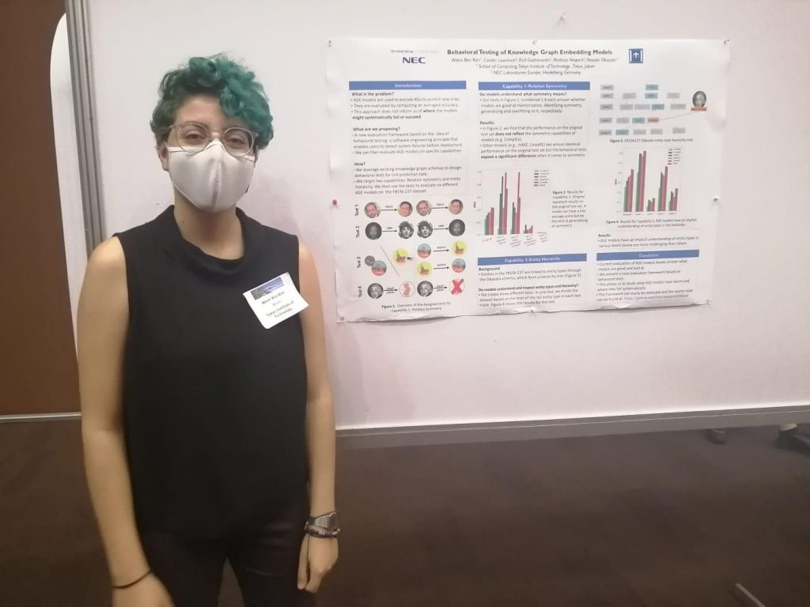
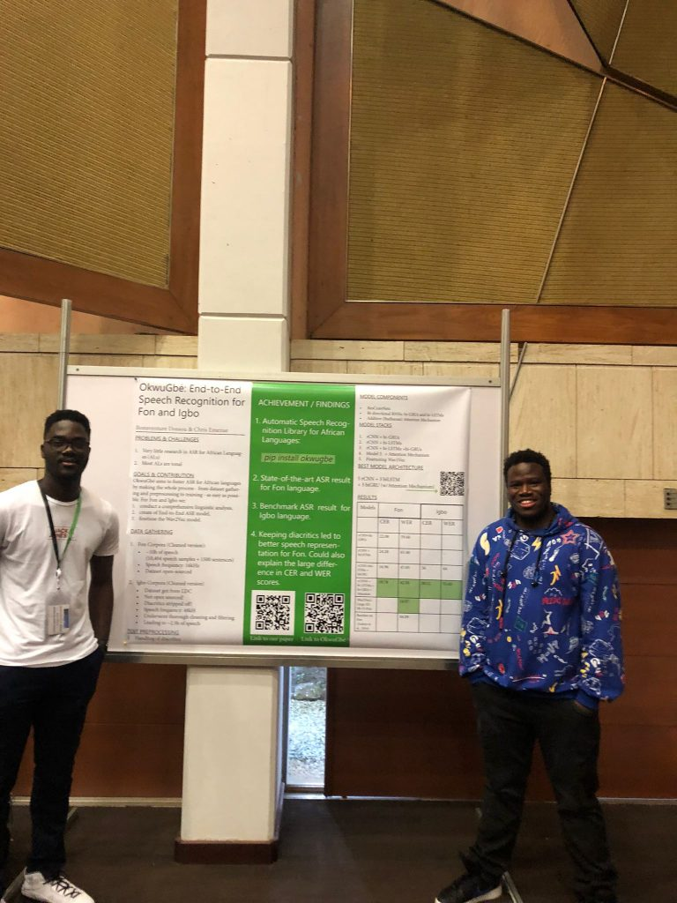
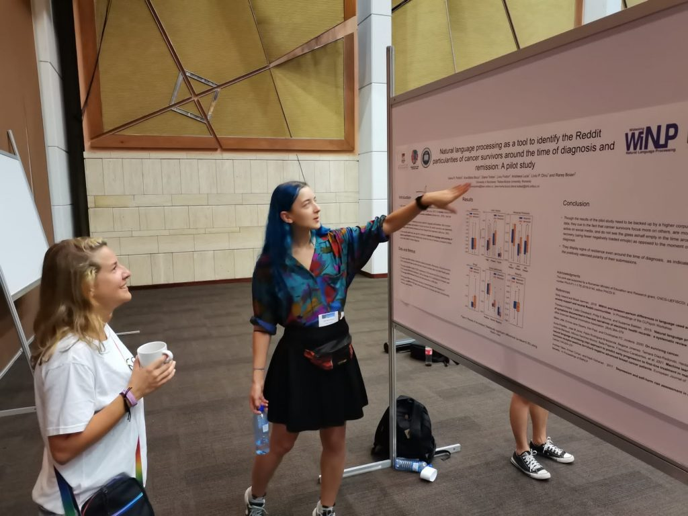
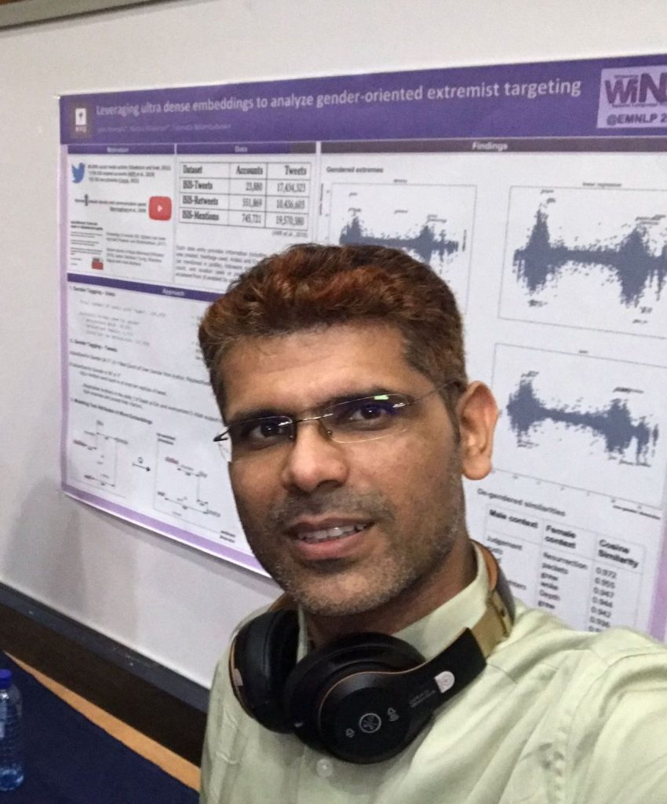
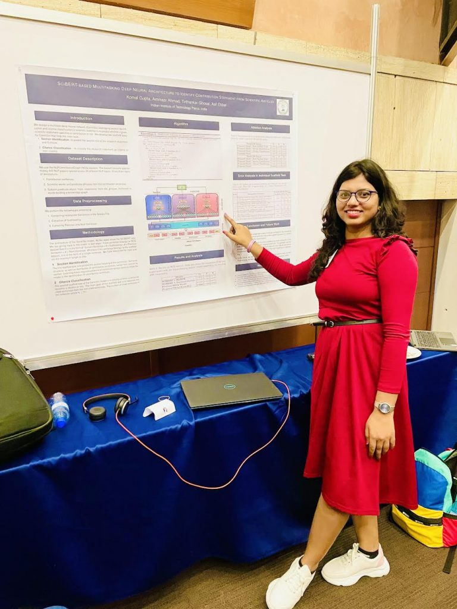
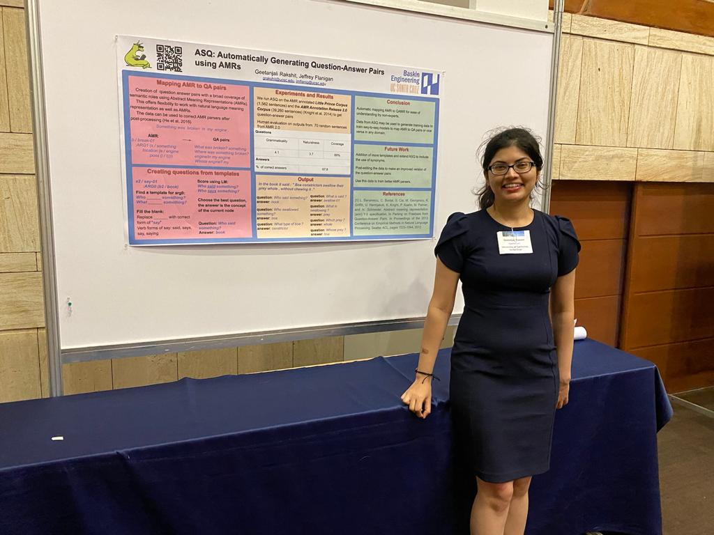
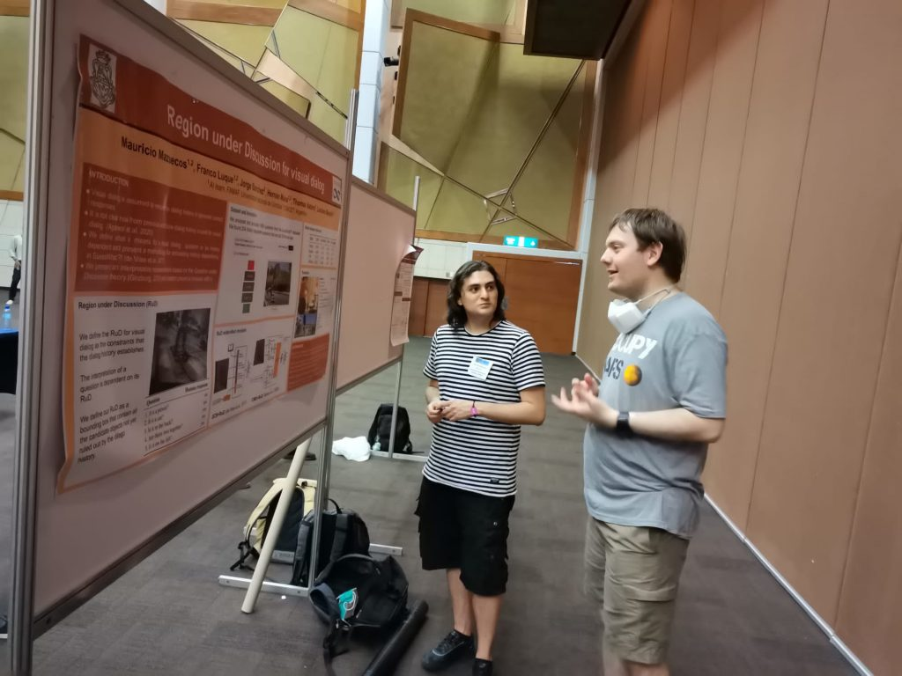
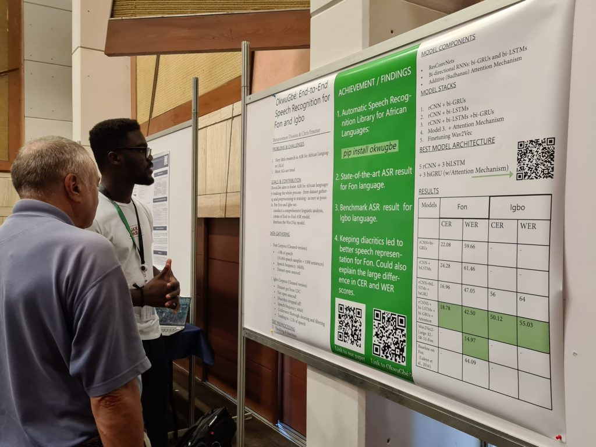

Accepted papers were presented online and in-person. WiNLP provided financial support to authors from around the world who chose to attend EMNLP in-person.

<figure>

- 
    
- 
    
- 
    
- 
    
- 
    
- 
    
- 
    
- 
    

<figcaption>

Authors presenting their work at EMNLP

</figcaption>

</figure>

* * *

Papers accepted at posters to Widening NLP 2021 are below. Note that some papers for authors who wished to remain anonymous or not publicly publish a camera-ready have been omitted.

| **No.** |  | **Title** | **Author** |
| --- | --- | --- | --- |
| 7 |  | [OkwuGbé: End-to-End Speech Recognition for Fon and Igbo](http://www.winlp.org/winlp2021_7_paper/) | Bonaventure F. P. Dossou and Chris Chinenye Emezue |
| 8 |  | [TEET! Tunisian Dataset for Toxic Speech Detection](http://www.winlp.org/winlp2021_8_paper/) | Slim Gharbi, Hatem Haddad, Mayssa Kchaou and Heger Arfaoui |
| 9 |  | Ara-Women-Hate: The first Arabic Hate Speech corpus regarding Women | Imane Guellil, Ahsan Adeel, Faical Azouaou, Mohamed Boubred, Yousra Houichi and Akram Moumna |
| 12 |  | Behavioral Testing of Knowledge Graph Embedding Models for Link Prediction | Wiem Ben Rim, Carolin Lawrence, Kiril Gashteovski, Mathias Niepert and Naoaki Okazaki |
| 13 |  | [Developing Language Technology and NLP tools for endangered languages: Torwali](http://www.winlp.org/winlp2021_13_paper/) | Naeem Uddin Hadi |
| 14 |  | How to Make Virtual Conferences Queer-Friendly: A Guide | Organizers of QueerInAI, A Pranav, MaryLena Bleile, Arjun Subramonian, Luca Soldaini, Danica J. Sutherland, Sabine Weber and Pan Xu |
| 15 |  | Neutralizing Gender Bias in Neural Machine Translation by Introducing Linguistic Knowledge | Ksenia Kharitonova, Marta R. Costa-jussà, Carlos Escolano, Christine Basta and Jordi Armengol-Estapé |
| 22 |  | [Developing Keyboards for the Endangered Livonian Language](http://www.winlp.org/winlp2021_22_paper/) | Mika Hämäläinen and Khalid Alnajjar |
| 24 |  | Nuanced Queerphobic Bias in Popular Sentiment Analysis Tools: A Data Set and Evaluation | Anonymous |
| 25 |  | [Coral: An Approach for Conversational Agents in Mental Health Applications](http://www.winlp.org/winlp2021_25_paper/ "Coral: An Approach for Conversational Agents in Mental Health Applications") | Harsh Sakhrani, Saloni Parekh and Shubham Mahajan |
| 26 |  | [EM ALBERT: A Step Towards Equipping Manipuri for NLP](http://www.winlp.org/winlp2021_26_paper/) | Rudali Huidrom and Yves Lepage |
| 28 |  | Elementary-Level Math Word Problem Generation using Pre-Trained Transformers | Anonymous |
| 29 |  | [Towards the Early Detection of Child Predators in Chat Rooms: A BERT-based Approach](http://www.winlp.org/winlp2021_29_paper/) | Sinchana Kumbale and Smriti Singh |
| 30 |  | One-Shot Lexicon Learning for Low-Resource Machine Translation | Anjali Kantharuban and Jacob Andreas |
| 32 |  | Sinhala-English Code-Mixed and Code-Switched Data Classification | Anonymous |
| 33 |  | ["I don't know who she is": Discourse and Knowledge Driven Coreference Resolution](http://www.winlp.org/winlp2021_33_paper/) | Angela Ramirez, Cecilia Li, Phillip Lee, Eduardo Zamora, Jeshwanth Bheemanpally, Marilyn Walker and Adwait Ratnaparkhi |
| 35 |  | Idiom Extraction Method with Fine-Tuning of Pre-trained Transformers for Named Entity Recognition | Nao Yamato |
| 36 |  | [Occupational Gender Stereotypes in Indic Languages](http://www.winlp.org/winlp2021_36_paper/) | Neeraja Kirtane and Tanvi Anand |
| 37 |  | [#WhyDidTheyStay: An NLP-Driven Approach to Analyzing the Factors that Affect Domestic Violence Victims](http://www.winlp.org/winlp2021_37_paper/) | Marthala Kavya and Smriti Singh |
| 38 |  | [Exploring Transfer Learning Pathways for Neural Machine Back Translation of Eskimo-Aleut, Chicham, and Classical Languages](http://www.winlp.org/winlp2021_38_paper/) | Aaron Serianni and Daniel Whitenack |
| 39 |  | An Interpretable Representation that Visually Grounds Dialog History | Mauricio Mazuecos, Franco M. Luque, Jorge Sánchez, Hernán Maina, Thomas Vadora and Luciana Benotti |
| 40 |  | [Automated Template Paraphrasing for Conversational Assistants](http://www.winlp.org/winlp2021_40_paper/) | Liane Vogel and Lucie Flek |
| 41 |  | Discovering Changes in Birthing Narratives During COVID-19 | Daphna Spira, Noreen Mayat, Caitlin Dreisbach and Adam Poliak |
| 42 |  | [Explorations in Transfer Learning for OCR Post-Correction](http://www.winlp.org/winlp2021_42_paper/) | Lindia Tjuatja, Shruti Rijhwani and Graham Neubig |
| 43 |  | [A Prototype Free/Open-Source Morphological Analyser and Generator for Sakha](http://www.winlp.org/winlp2021_43_paper/) | Sardana Ivanova, Francis Tyers and Jonathan N. Washington |
| 44 |  | Towards Text Simplification for Sinhala Language | Anonymous |
| 46 |  | [Natural Language Processing as a Tool to Identify the Reddit Particularities of Cancer Survivors Around the Time of Diagnosis and Remission: A Pilot Study](http://www.winlp.org/winlp2021_46_paper/) | Ioana R. Podină, Ana-Maria Bucur, Diana Todea, Liviu Fodor, Andreea Luca, Liviu P. Dinu and Rareș Boian |
| 48 |  | Identifying Significant Citations via Mining Paper Full-Text | Muskaan Singh and Tirthankar Ghosal |
| 49 |  | SciBERT-based Multitasking Deep Neural Architecture to Identify Contribution Statements from Scientific Articles | Komal Gupta, Ammaar Ahmad, Tirthankar Ghosal, and Asif Ekbal |
| 51 |  | Characterizing Test Anxiety on Social Media | Esha Julka, Olivia Kowalishin, Jalisha B. Jenifer and Adam Poliak |
| 52 |  | [Sample Selection Guided by Domain and Task for Cross-Domain Targeted Sentiment Analysis](http://www.winlp.org/winlp2021_52_paper/) | Kasturi Bhattacharjee, Rashmi Gangadharaiah and Smaranda Muresan |
| 53 |  | [Bengali Parallel Universal Dependency Treebank](http://www.winlp.org/winlp2021_53_paper/) | Pritha Majumdar |
| 54 |  | [The Development of Pre-processing Tools and Pre-trained Embedding Models for Amharic](http://www.winlp.org/winlp2021_54_paper/) | Tadesse Destaw, Abinew Ayele and Seid Muhie Yimam |
| 55 |  | [Towards Syntax-Aware Dialogue Summarization using Multi-Task Learning](http://www.winlp.org/winlp2021_55_paper/) | Seolhwa Lee, Kisu Yang, Chanjun Park, João Sedoc and Heuiseok Lim |
| 56 |  | Detoxifying Language Models with Proximal Policy Optimization | Taaha Kazi |
| 59 |  | [Towards Personalized Descriptions of Scientific Concepts](http://www.winlp.org/winlp2021_59_paper/) | Sonia Murthy, Daniel King, Tom Hope, Daniel Weld and Doug Downey |
| 60 |  | [Building Prosody Labeled Corpus in Hindi](http://www.winlp.org/winlp2021_60_paper/) | Esha Banerjee, Atul Kr. Ojha and Girish Jha |
| 61 |  | [How Well Can an Agent Understand Different Accents?](http://www.winlp.org/winlp2021_61_paper/) | Divya Tadimeti, Kallirroi Georgila and David Traum |
| 62 |  | [Monolingual Pre-Trained Language Models for Tigrinya](http://www.winlp.org/winlp2021_62_paper/) | Fitsum Gaim, Wonsuk Yang and Jong C. Park |
| 63 |  | ASQ: Automatically Generating Question-Answer Pairs using AMRs | Geetanjali Rakshit and Jeffrey Flanigan |
| 64 |  | [Adverse Drug Reaction Classification of Tweets with Fusion of Text and Drug Representations](http://www.winlp.org/winlp2021_64_paper/) | Andrey Sakhovskiy and Elena Tutubalina |
| 65 |  | Detecting Gender Bias Using Explainability | Gauri Gupta, Supriti Vijay and Krithika Ramesh |
| 69 |  | Leveraging Ultradense Embeddings to Analyze Gender-Oriented Extremist Recruitment Targeting | Jatin Khilnani, Rasika Bhalerao and Tatenda Ndambakuwa |
