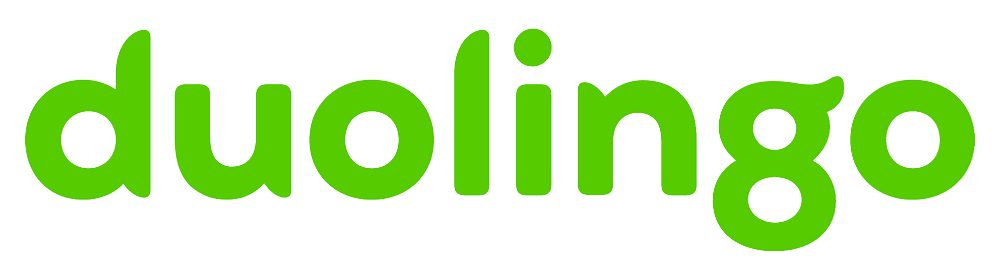
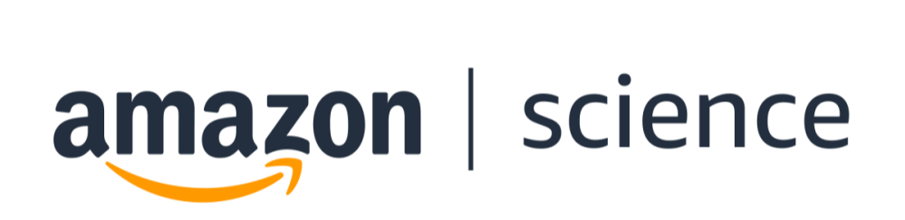

We are excited this year to have a variety of virtual events this year leading up to our Widening NLP 2021 Workshop! This will include both programming for mentorship through Widening NLP and career mentorship opportunities provided by our sponsors.

_The text for the sponsor events below has been provided by our sponsors._

### November 1, 2021

**An Inside View of NLP at Duolingo**  
3:30-4:30 PM EST/AST

Join us for a career panel and Q&A for a view inside NLP at Duolingo! Ask ML/NLP researchers and engineers questions about their work, career opportunities, and more. Know more about Duolingo Research: [https://research.duolingo.com](https://research.duolingo.com/)

RSVP here: [https://www.eventbrite.com/e/an-inside-view-of-nlp-at-duolingo-tickets-195168212377](https://www.eventbrite.com/e/an-inside-view-of-nlp-at-duolingo-tickets-195168212377)

Panelists:

- Ze-Xin Koh, Software Engineer I
- Andrew Runge, Machine Learning Engineer II
- Lauren Bilsky, Machine Learning Engineer II
- Klinton Bicknell, Senior Research Scientist
- Jill Burstein, Principal Assessment Scientist

Moderator: Burr Settles, Research Director

Learn more about Duolingo Research: [https://research.duolingo.com](https://research.duolingo.com/)

_Duolingo is supporting Widening NLP this year as a Bronze Sponsor._

### November 3, 2021

**NLP at Microsoft Research:** **"Ask Me Anything"**  
**with Alexandra Olteanu (Microsoft Research Montreal) and Hanna Wallach (Microsoft Research NYC)**  
3:00-4:00 PM EST/AST

Please join us for a live, virtual "Ask Me Anything" with Alexandra Olteanu, Microsoft Research Montreal, and Hanna Wallach, Microsoft Research NYC. This is an opportunity to learn from researchers as they share their work experience, NLP projects, and available intern and career opportunities at Microsoft Research.

RSVP ahead of the event: [https://aka.ms/WiNLPAskMeAnythingRegistration](https://aka.ms/WiNLPAskMeAnythingRegistration)  
Link to Attend: [https://aka.ms/WiNLPAskMeAnything](https://aka.ms/WiNLPAskMeAnything)

### November 5, 2021

**2021 Amazon WiNLP Virtual Fireside Chat**  
2:00-3:00 PM EST/AST

At Amazon, the spirit of innovation is part of our DNA. We strive to hire the brightest minds from universities all around the globe, and we have career opportunities throughout Amazon for students from all backgrounds. Join us to listen to our panel of scientists at Amazon talk about their experience and to learn more about interning with Amazon.

You can register to join the event here: [https://2021amazonwinlp.splashthat.com/](https://2021amazonwinlp.splashthat.com/)

Panelists:

- Anna Currey, Applied Scientist for AWS AI
- Rashmi Gangadharaiah, Senior Research Scientist
- Maria Nadejde, Applied Scientist

Moderator: Amber Hathaway, Senior Recruiter for Graduate Research

_Amazon is supporting Widening NLP this year as a Gold Sponsor._ 

### November 10, 2021

**Meet Apple**  
5:30-6:00 PM EST / 6:30-7:00 PM AST

This event will be an opportunity to learn more about our publications, working at Apple, and how to apply to full-time positions. Join us to hear from Apple researchers, hiring managers, and recruiting team.

RSVP here: [https://applecorp.avature.net/emnlpmeetapple](https://applecorp.avature.net/emnlpmeetapple)  
Join the event here: [https://appleinc.webex.com/appleinc/onstage/g.php?MTID=e01032132c5700d6b2f575417d347e16c](https://appleinc.webex.com/appleinc/onstage/g.php?MTID=e01032132c5700d6b2f575417d347e16c)

_Apple is supporting Widening NLP this year as a Platinum Sponsor._

**Apple Internship Q&A Panel**  
7:00-7:30 PM EST / 8:00-8:30 PM AST

Apple will be hosting a presentation from our AI/ML organization, and you’re invited to attend. This event is an opportunity to learn more about internships opportunities at Apple across our machine learning teams. 

Have questions for the speaker? Please send your questions to [AIML\_conferences\_internrecruit@apple.com](mailto:AIML_conferences_internrecruit@apple.com)

RSVP here: [https://applemaster.avature.net/su/b77b6b0b26436a0b](https://applemaster.avature.net/su/b77b6b0b26436a0b)  
Join the event here: [https://appleinc.webex.com/appleinc/onstage/g.php?MTID=ee61dd45676b9934395803761a245fa9e](https://appleinc.webex.com/appleinc/onstage/g.php?MTID=ee61dd45676b9934395803761a245fa9e)

_Apple is supporting Widening NLP this year as a Platinum Sponsor._
