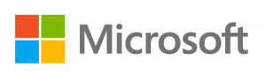
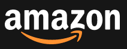
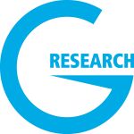
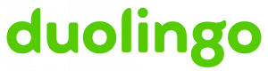
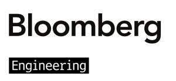
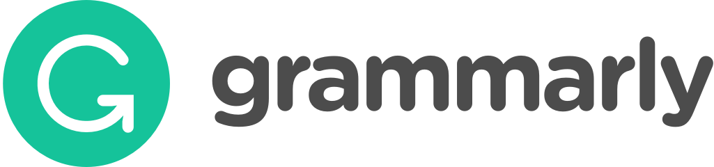

## We thank all our sponsors for supporting the WiNLP community!

Note: we are still welcoming more sponsors for our event this year, so this page will continue to be updated.

## **Platinum Sponsors:**

## 

* * *

## **Gold Sponsors:**

##          

* * *

## **Silver Sponsors:**

##    

* * *

## **Bronze Sponsors:**   

##  

* * *

## **In Kind Sponsors:**

    
