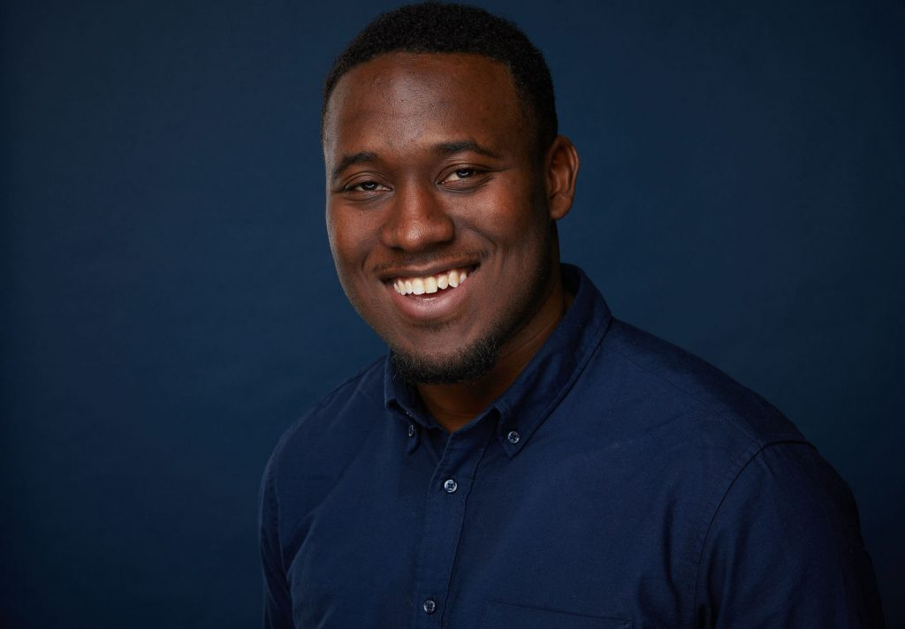
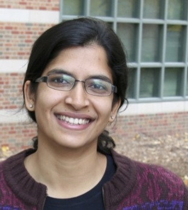
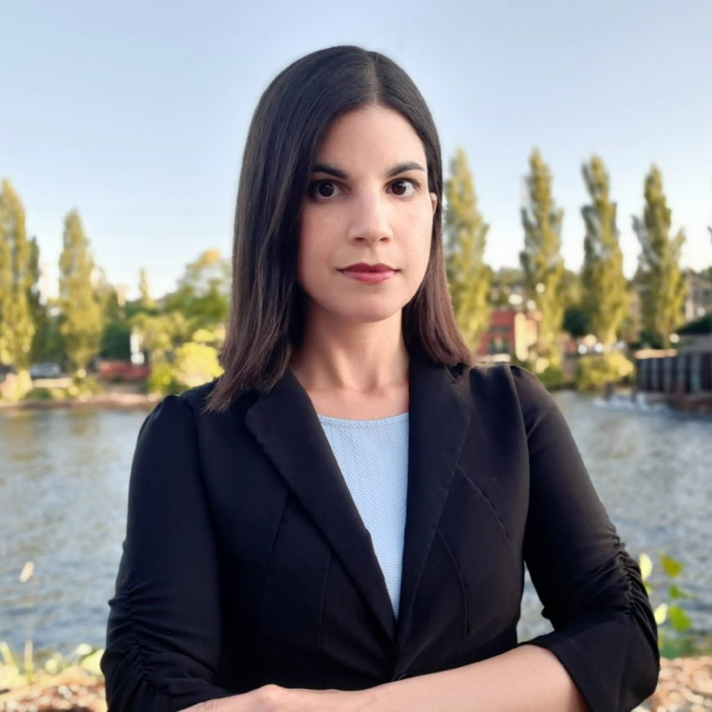
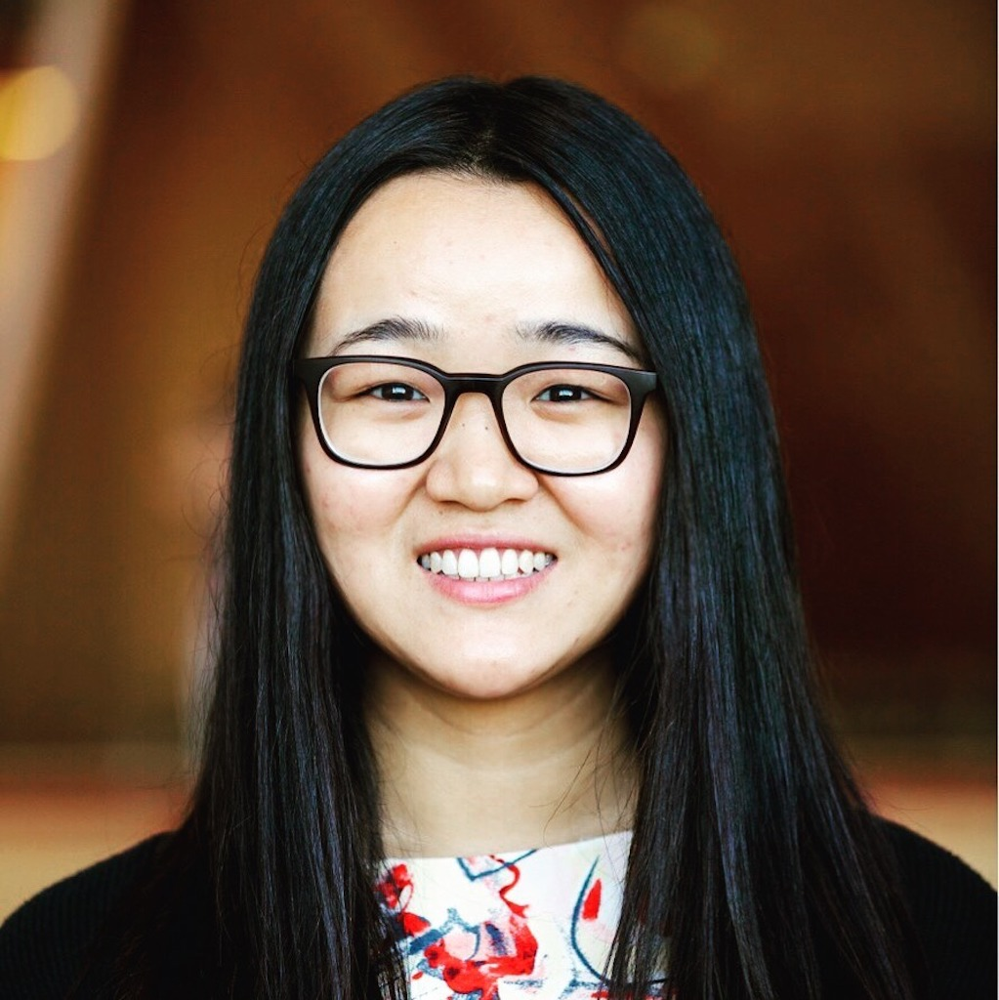

**Register here to attend: [WiNLP NAACL 2022 Satellite Event on Eventbrite](https://www.eventbrite.com/e/widening-nlp-satellite-workshop-at-naacl-2022-tickets-345885913077)**

We will be holding a FREE online satellite event in conjunction with NAACL 2022 on July 10th, 2022. Our event will include a keynote speaker, a panel research discussion, and a mentorship roundtable. Our event is a free D&I event as opposed to a regular ACL workshop. Everyone is welcome to attend for free.

The current schedule of the workshop is:

- Intro and Keynote (8-9 am PDT)
- Mentorship Lunch (12-1 pm PDT)
- Panel and goodbye (5-6 pm PDT)

**We are providing a mentoring session to help participants have their questions (about various topics including academic research) answered. To gauge interest in topics for our mentoring program, we invite potential mentees to fill out our topic interest form [here](https://forms.office.com/r/Axh1pMg8L1).**

### Summary of important dates:

- Abstract submission: May 6, 2022
- Decision on acceptance: May 13, 2022
- Workshop: July 10, 2022
- Poster session (joint with other inclusion organizations): TBD, during NAACL July 10-15

Stay tuned for more information about our poster session and the panel discussion!

## Speakers

**Keynote Speaker**

<figure>

<figcaption>

Lydia smiles and tilts their head slightly to the side, looking confidently at the camera. They are a young-ish East Asian person with a streak of teal in their short black hair, wearing glasses, a cobalt blue jacket and navy tie, with a blue copper wall behind them. Photo by Sarah Tundermann

</figcaption>

</figure>

**Lydia X. Z. Brown** is an abolitionist advocate, organizer, attorney, strategist, and writer whose work focuses on interpersonal and state violence against disabled people at the intersections of race, class, gender, sexuality, faith, language, and nation. Their other interests include carcerality and institutional violence, asexuality as queerness, algorithmic harm as an accelerating force of systemic injustice, and the ableism-racism nexus of transracial and transnational adoption. Lydia is Policy Counsel for Privacy & Data at the Center for Democracy & Technology, focused on algorithmic discrimination and disability, as well as Director of Policy, Advocacy, & External Affairs at the Autistic Women & Nonbinary Network. Lydia is also an adjunct lecturer in the Women's and Gender Studies Program and the Disability Studies Program at Georgetown University, and an adjunct professorial lecturer in American Studies in the Department of Critical Race, Gender, and Culture Studies at American University. They are the current co-president of the Disability Rights Bar Association, a commissioner on the American Bar Association’s Commission on Disability Rights, and Disability Justice Committee representative on the National Lawyers Guild board. Lydia founded the Fund for Community Reparations for Autistic People of Color’s Interdependence, Survival, and Empowerment, a project of collective care, redistributive justice, and mutual aid, and they are currently creating Disability Justice Wisdom Tarot. Often, their most important work has no title, job description, or funding, and probably never will.

## **Panel**: Applying to Graduate School

The panel will focus on graduate school applications with the goal of helping students around the globe with diverse backgrounds select and apply for graduate programs.

<figure>

<figcaption>

Kianté Brantley smiles in front of a blue background.

</figcaption>

</figure>

**Kianté Brantley** is a Postdoctoral scholar at Cornell working with Thorsten Joachims. He completed his Ph.D. in computer science at the University of Maryland College Park (UMD) advised by Professor Hal Daumé III. Brantley designs algorithms that efficiently integrate domain knowledge into sequential decision-making problems. He is most excited about imitation learning and interactive learning—or, more broadly, settings that involve a feedback loop between a machine learning agent and the input the machine learning agent sees.

Before coming to UMD in 2016, Brantley attended the University of Maryland, Baltimore County where he earned his bachelor’s degree and master's degree (advised by Tim Oates) in computer science. He also worked as a data scientist for the U.S. Department of Defense from 2010 to 2017. In his free time, Brantley enjoys playing sports; his favorite sport at the moment is powerlifting.

<figure>

<figcaption>

Professor Preethi Jyothi smiles at the camera in glasses and a maroon sweater.

</figcaption>

</figure>

**Preethi Jyothi** is an Associate Professor in the Department of Computer Science and Engineering at IIT Bombay. Her research interests are broadly in machine learning applied to speech and language, specifically focusing on Indian languages and low-resource settings. She was a Beckman Postdoctoral Fellow at the University of Illinois at Urbana-Champaign from 2013 to 2016. She received her Ph.D. from The Ohio State University in 2013. Her doctoral thesis dealt with statistical models of pronunciation in conversational speech and her work on this topic received a Best Student Paper award at Interspeech 2012. She co-organised a research project on probabilistic transcriptions at the 2015 Jelinek Summer Workshop on Speech and Language Technology, for which her team received a Speech and Language Processing Student Paper Award at ICASSP 2016. She was awarded a Google Faculty Research Award in 2017 for research on accented speech recognition. She currently serves on the ISCA SIGML board and is a member of the Editorial Board of Computer Speech and Language. 

<figure>

<figcaption>

Professor Vered Shwartz looks at the camera while standing in front of trees and a body of water.

</figcaption>

</figure>

**Vered Shwartz** is an Assistant Professor of Computer Science at the University of British Columbia. Her research interests include commonsense reasoning, computational semantics and pragmatics, and multiword expressions. Previously, Vered was a postdoctoral researcher at the Allen Institute for AI (AI2) and the University of Washington. She received her PhD in Computer Science from Bar-Ilan University. Vered's work has been recognized with several awards, including The Eric and Wendy Schmidt Postdoctoral Award for Women in Mathematical and Computing Sciences, the Clore Foundation Scholarship, and an ACL 2016 outstanding paper award.

<figure>

<figcaption>

Professor Diyi Yang smiles in front of a blurry gold background.

</figcaption>

</figure>

**Diyi Yang** is an assistant professor in the School of Interactive Computing at Georgia Tech.  Her research interests are computational social science and natural language processing. Her research goal is to understand the social aspects of language and then build socially aware NLP systems to better support human-human and human-computer interaction. Her work has received multiple paper awards or nominations at ICWSM, EMNLP, ACL, SIGCHI, and CSCW.  She is a recipient of Forbes 30 under 30 in Science (2020),  IEEE “AI 10 to Watch” (2020), the Intel Rising Star Faculty Award (2021),  Microsoft Research Faculty Fellowship (2021),  and NSF CAREER Award (2022).

## Posters for Inclusion Social

**Accepted Posters:**

Julia Mendelsohn, Ceren Budak, and David Jurgens. Modeling Framing in Immigration Discourse on Social Media.

Garima Giri, Robert M. Scott, and Snigdha Chaturvedi. Affects of Remote Learning on Academic Performance of High School Students.

* * *

\--The call for posters deadline has closed--

We invite interested NLP researchers who identify themselves as underrepresented to submit to the WiNLP poster session (as part of the joint NAACL 2022 affinity group poster session). 

While poster submissions **will not undergo peer review**, we will follow an informal submission process to ensure submissions are relevant to NLP or topics of inclusion in our research community. Please submit [this Google form](https://docs.google.com/forms/d/e/1FAIpQLSe2BiZQtYq3roHB4dTsy6egtqcmuiC5aE_1tdI9jyCg8frdVw/viewform?usp=sf_link) with either a one-page abstract of your intended topic or an already-completed poster in PDF form by **May 6, 2022**. The submissions will be screened by the WiNLP chairs to ensure relevance to NLP and/or topics of inclusion in our community. **This event is non-archival and will have no public proceedings available after the event**.

Unlike our main annual event happening this December at EMNLP 2022, we will not be able to provide direct travel support for attending NAACL 2022 in Seattle. We encourage interested attendees looking for support for in-person attendance to look out for announcements from the NAACL D&I committee for travel funding for that event.

If you have questions or are unable to use this form, please reach out to the chairs at [winlp-chairs@googlegroups.com](mailto:winlp-chairs@googlegroups.com) for support.
