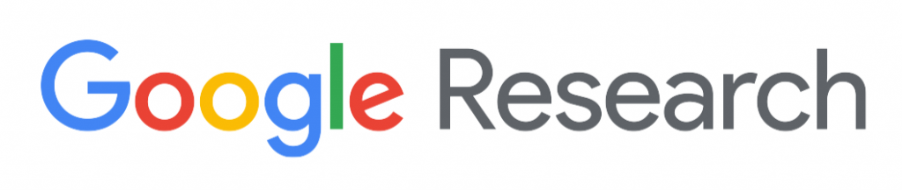
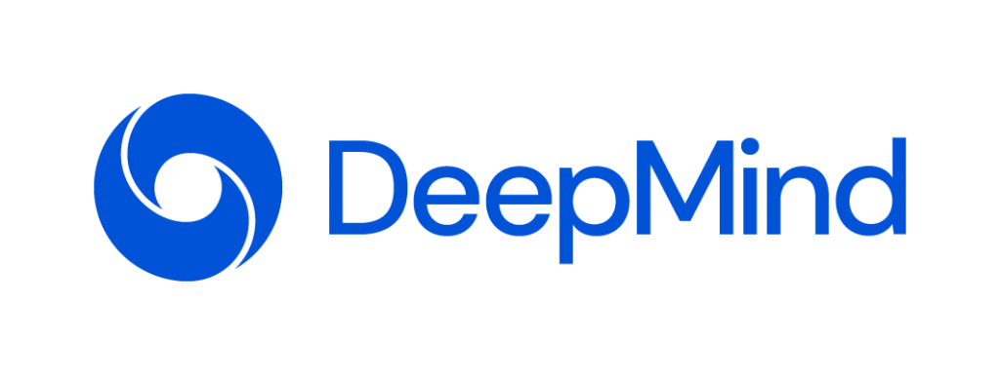
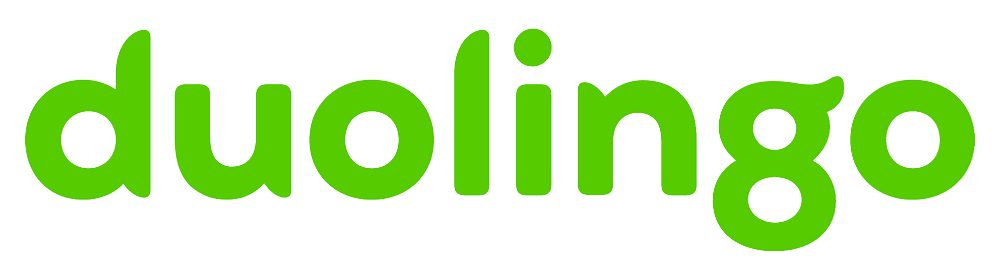
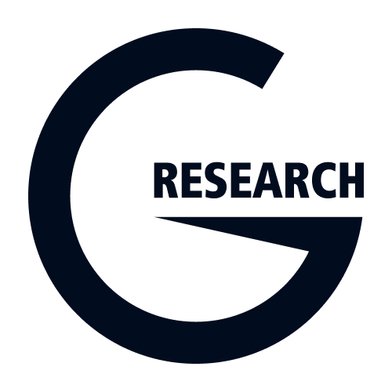

We are currently reaching out to sponsors to request funding and will list our sponsors here as they are confirmed. For more information on how this list develops, please view our [Sponsor Policy](http://www.winlp.org/sponsor-policy/ "Sponsor Policy").

_Widening NLP does not endorse the sponsors of our workshop as employers, nor do we endorse the views they express or the products/services they offer. We are grateful for their sponsorship of our programs and we encourage our participants to do their own research into these organizations._

Want to join us as a sponsor? Email [winlp-chairs@googlegroups.com!](winlp-chairs@googlegroups.com)

## Major Sponsors

## Supporting Sponsors

## Non-Profit Sponsors

## Special Sponsorships

Transcription - [KUNGFU.AI](https://www.kungfu.ai/)  
Catered Lunch for Authors - [Google Research](https://research.google/)
