# \---This workshop is over.---

You can view the [transcripts](https://docs.google.com/document/d/127OpXYgsddTCu1udJeqvYaRo__EJUT_5wM-UftA4mbA/edit?usp=sharing) from this event.

* * *

Our main annual workshop will be co-located with EMNLP 2022 as a hybrid event on Zoom and in Abu Dhabi, UAE on December 7th. You can view our call for submissions [here](http://www.winlp.org/winlp22-call-for-papers/ "WiNLP 2022 – Call for Submissions"). The workshop is free and open to the general public. The in-person event will take place in Capital Suite 21B. The online event will take place on Zoom; to receive the link, please register for free on [Eventbrite](https://www.eventbrite.com/e/winlp-emnlp-2022-tickets-464771824037).

## Schedule

| Event | Tentative Time (in Gulf Standard Time) |
| --- | --- |
| Poster Session | 8:45-9:45 |
| Welcome | 9:45-10:00 |
| Panel: Finding a cool job in NLP | 10:00-10:50 |
| Coffee Break | 10:50-11:00 |
| Keynote and Q&A: [Prof. Houda Bouamor](https://www.andrew.cmu.edu/user/hbouamor/) | 11:00-11:50 |
| Break (Noon Prayer) | 11:50-12:30 |
| Sponsors' Lunch | 12:30-1:30 |
| Panel: Being a researcher in Arabic NLP | 1:30-2:20 |
| Coffee Break | 2:20-2:30 |
| Second Poster Session | 2:30-3:10 |
| Break (Afternoon Prayer) | 3:10-3:30 |
| Fireside chat: [Dr. Klaus Zechner](https://scholar.google.com/citations?user=eVYrz4EAAAAJ&hl=en) | 3:30-4:20 |
| Closing Session | 4:30-4:50 |

## Speakers

## Panel: Finding (or Making) a Cool Job in NLP

<figure>

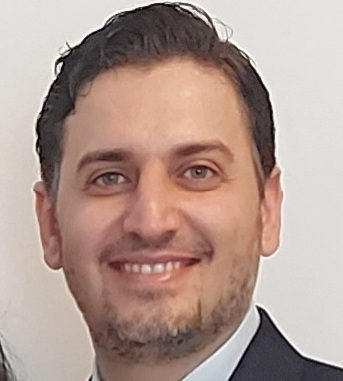

<figcaption>

Dr. Hussein AL-NATSHEH, CTO of Unstructured Data

</figcaption>

</figure>

**Dr. Hussein AL-NATSHEH**

Dr AL-NATSHEH joined Beyond Limits in early 2021 and is a recognized AI leader in the Middle East, being a member of several program committees in NLP and a speaker in many AI regional events. He brings a total experience of 18+ years in digital transformation and technology business innovation with a focus on AI solutions. Prior to joining Beyond Limits, he was the Chief AI Officer at Mawdoo3 Limited, the world's most visited group of Arabic websites. He joined Mawdoo3 as an executive in 2016 after acquiring his data mining start-up where he founded its AI division that developed its state-of-the-art Arabic NLP/NLU SaaS toolkit with the biggest data science team in the region at that time. There, he also co-founded 2 AI subsidiaries; the first Arabic voice digital assistant (Salma.ai), which is like "Siri" but understands Arabic dialects, and (Qalam.ai) which is like “Grammarly” but specialized in the Arabic language. Hussein holds a Ph.D. degree from the University of Lyon, France in Data Science, in addition to 2 European Master's degrees in the same field and a master’s degree in computer engineering from Jordan. He made the later master’s thesis in machine learning at the European Organization for Nuclear Research (CERN) in Switzerland. In 2009, he founded (Ciapple), a data mining and predictive analytics technology startup. His startup received several regional technology business innovation awards. Previously in 2007, he served as the technology commercialization program manager at Queen Rania Center for Entrepreneurship (QRCE) in Jordan the director of its innovation division (TRIZmatic) helping El Hassan Science City in Jordan (The higher umbrella of 4 organizations at that time; QRCE, PSUT, RSS, and HCST) in building its knowledge economy strategy for the country and establishing its national Technology Transfer Office (TTO).

<figure>

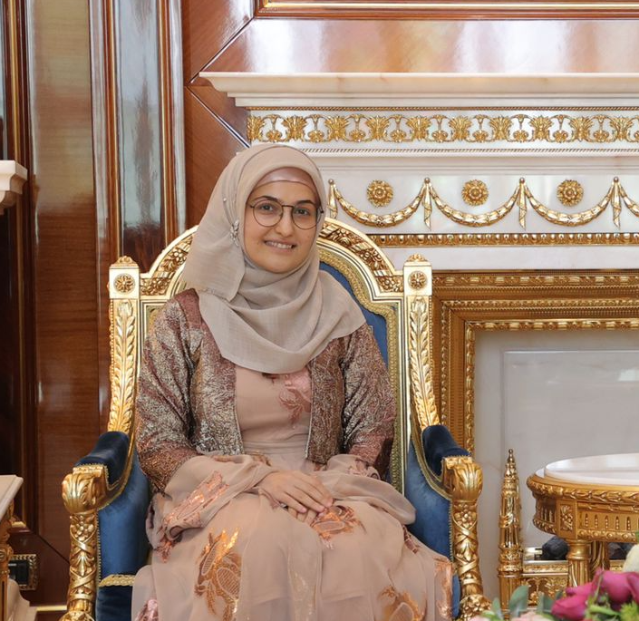

<figcaption>

Photo of Roshna sitting on a chair wearing Kurdish clothes.

</figcaption>

</figure>

**Roshna Omer Abdulrahman**

Roshna Omer Abdulrahman is an Information Management Associate at UNHCR Iraq. She has over five years of experience working as a software engineer. She has published research on Low resource NLP for Kurdish as a part of her master's degree and is trying to keep up with NLP outside of her day job. She has BSc in Computer Science and an MSc in Software Engineering. In her free time, you will find her taking a walk with an audiobook in her ears.

<figure>

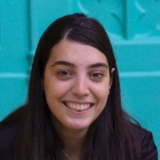

<figcaption>

Kinda Altarbouch

</figcaption>

</figure>

**Kinda Altarbouch**

Kinda Altarbouch co-founder & CEO at Lableb which develops digital services and Arabic language technology products. Kinda was listed in MIT Innovators Under 35 (MENA region) in 2020. She was chosen by the Arab Youth Center as a Young Arab Pioneer in 2017 & 2018. Also, She is a member of the Board of Advisory Council of Popular Science Magazine (Arabic Edition) since 2017 and a member of the Syrian Society for Scientific Research (SySSR) since 2014. She has served as a teaching assistant at Damascus University and scientific supervisor for the Robotic Club in the same faculty from 2015 to 2018. She holds a bachelor's degree in Computer Science and Artificial Intelligence from Damascus University, Syria.

<figure>

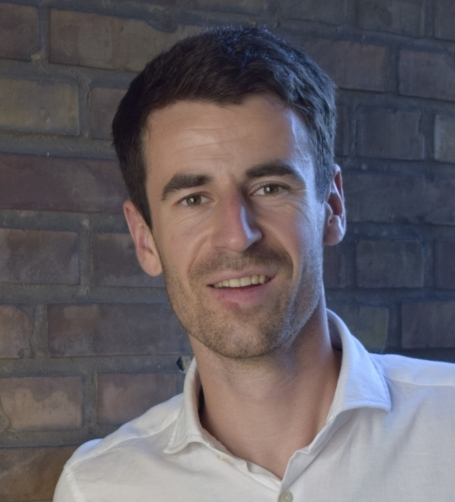

<figcaption>

Photo of Felix Laumann

</figcaption>

</figure>

**Felix Laumann**

**Felix Laumann** holds a PhD in Statistics from Imperial College London. He is the CEO at NeuralSpace, a platform to build Natural Language Processing (NLP) solutions in a no-code web interface and through simple APIs. NeuralSpace offers 80+ languages spoken in India, the Middle East and Africa, such as 7 Arabic dialects and 11 Indian languages.

<figure>

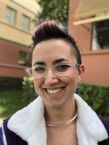

<figcaption>

This photo depicts Erika, a white woman with pink and brown short hair, and glasses, outdoors in front of buildings and grass.

</figcaption>

</figure>

**Erika Varis Doggett**

Erika is a Sr. Research Scientist at Disney Research Studios focusing on a variety of topics within machine learning, with special attention to computer vision, generative imagery, and natural language processing techniques. Recent areas of interest include natural language generation, inpainting-based anomaly detection, neural style transfer, attention & saliency prediction, entity extraction & classification, speech recognition, machine translation, and other sequencing models. Prior to Disney Research, Erika managed an applied R&D artificial intelligence/machine learning team within the StudioLAB at Walt Disney Studios. Erika received my Ph.D. in Linguistics from the University of Southern California and lectured for two years at the University of Nevada Reno before transitioning to industry in NLP for social media data.

## Keynote

<figure>

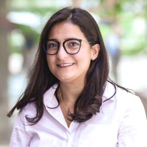

<figcaption>

This photo depicts Houda, a white woman with long brown hair, wearing a pink shirt and glasses with a blurred background.

</figcaption>

</figure>

**Houda Bouamor**

Houda Bouamor is an Associate Teaching Professor of Information Systems and a Research Scientist working in the fields of Natural Language Processing and Computational Linguistics. She is also affiliated with the CAMeL Lab at NYU Abu Dhabi. She received her Ph.D. in Computer Science from Paris-Sud University, France. Her research revolves around Arabic NLP, user-generated content processing and social media analysis, and NLP in the domain of finance. Her key achievements include top-tier journal and conference publications. She is an active member of the research community serving as a program committee member in over 20 conferences. She has also led and co-led the organization of a number of workshops and shared tasks on Arabic NLP and Financial NLP in ACL and other conferences such as EMNLP 2022.

## Panel: Being a Researcher in Arabic NLP

<figure>

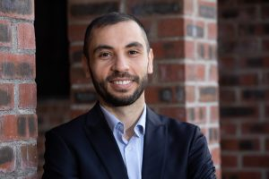

<figcaption>

Lecturer in AI at Munster Technological University, Head of MTU Human Centred AI Research Group and Co-fouder of LinguAnalysis

</figcaption>

</figure>

**Haithem Afli**

Dr Haithem Afli is a leading expert in Natural Language Processing and Artificial Intelligence and a rising star in the area of applied Artificial Intelligence in Healthcare, Life-science, and Fintech. Dr Afli is lecturing AI within the Computer Science Department of Munster Technological University (MTU) in Ireland and leading the MTU Human Centred AI Research Group, HAI. Dr Haithem Afli is Science Foundation Ireland funded investigator at ADAPT Centre where he is responsible for leading one of the three challenge leads of the DCT strand and he is a member of the ADAPT Executive Management Committee, representing MTU. Haithem's research interest is primarily focuses in the areas of Machine Translation, Sentiment Analysis, Natural Language Processing and Machine Learning. Dr Afli has published over 70 peer reviewed research articles and is serving as Editor, Program Chair, Program Committee Member and advisor in many international research conferences and journals. Dr Haithem Afli was a key contributor to the recently established MTU Masters programmes on Computational Biology and Artificial Intelligence. As an academic researcher, Haithem is keen to commercialise his research with industry partnerships and is actively involved in managing academia-industry partnership projects including co-founding LinguAnalysis.ai.

<figure>

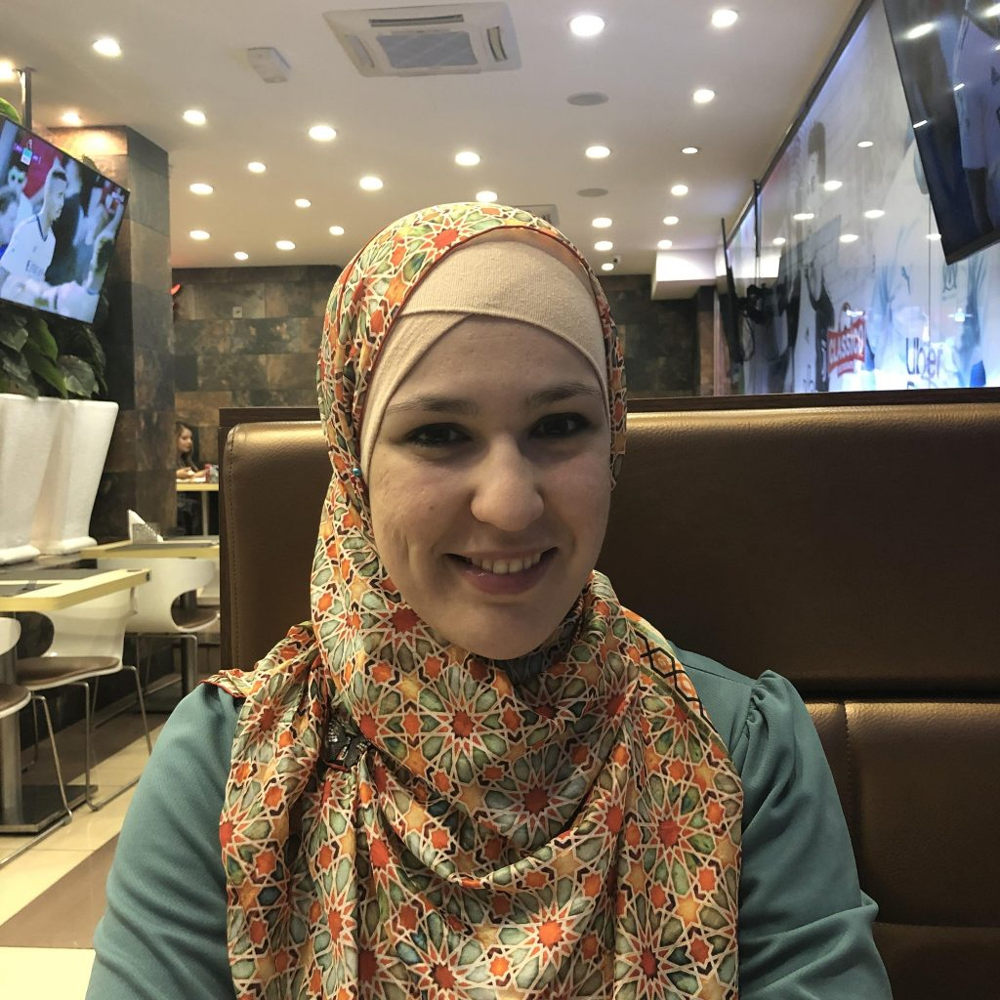

<figcaption>

Photo of Nedjma Ousidhoum.

</figcaption>

</figure>

**Nedjma Ousidhoum**

Nedjma Ousidhoum is a Postdoctoral Research Associate at the University of Cambridge. Nedjma works on automated fact-checking for journalists. Prior to this, Nedjma was a PhD student at the Hong Kong University of Science and Technology (HKUST) where they worked on toxic content detection in NLP. Nedjma is also one of the co-organisers of the Afrisenti Semeval shared task, we have built sentiment analysis datasets for African language including Algerian Arabic.

<figure>

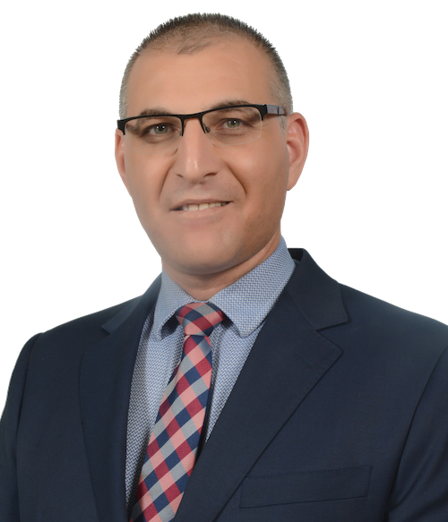

<figcaption>

Mustafa Jarrar

</figcaption>

</figure>

**Mustafa Jarrar**

A full professor of Computer Science, and director of the PhD program at Birzeit University in Palestine. He was a Fulbright visiting professor at the University at Buffalo in the USA (2016-2017), a Marie Curie fellow at the University of Cyprus (2007-2009), and a senior research scientist at Vrije Universiteit Brussel (1999-2007), where he completed his Masters (2000) and PhD (early 2005). He has won several prestigious awards including, among others, the Shoman Arab Researchers Award in Technology, Mohammed Bin Rashid Award for the Arabic Language, and Google Faculty Research Award. Prof. Jarrar has published 80+ articles in the areas of Natural Language Processing, Ontology Engineering, Semantic Web, and Graph Databases. He chaired 23 international workshops, a PC member of 150+ journals/conferences, a coordinator/manager of 25 large EU projects, a full member of the IFIP2.6 on Database Semantics, the IFIP2.12 on Web Semantics, and the UN ESCWA Technology Centre Board of Governors, among others. Prof. Jarrar is also the founder of both Sina Institute for Knowledge Engineering and Language Technologies, and the Palestinian eGovernment Academy, and advisor at the Palestinian ministry of Telecom & IT for e-government topics, where he developed and chaired the Palestinian e-Government Interoperability Framework (called Zinnar).

<figure>

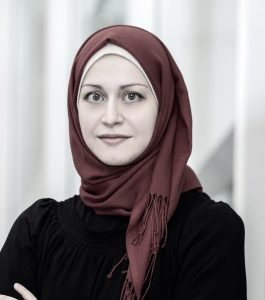

<figcaption>

A photo of Mai Oudah

</figcaption>

</figure>

**Mai Oudah**

Mai is a Lecturer of Computer Science at NYU Abu Dhabi. Her main research areas of interest are Natural language processing (NLP) and Bioinformatics. Prior to that, Mai was a Postdoctoral Associate at the CAMeL lab in NYU Abu Dhabi. Her research in NLP focusses on Named Entity Recognition and Machine Translation.

## Fireside Chat

<figure>

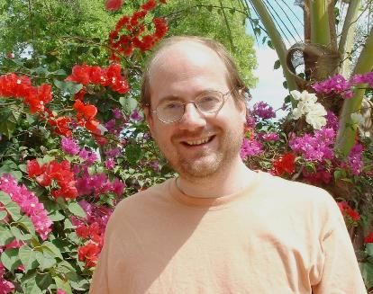

<figcaption>

Klaus Zechner, ETS

</figcaption>

</figure>

**Klaus Zechner**

Klaus Zechner obtained his Ph.D. in Language Technologies from Carnegie Mellon University, and joined Educational Testing service (ETS) as a research scientist in 2002. He currently works in the Artificial Intelligence Research Lab at ETS on automated scoring of speech. He has been pioneering research and development of technologies for automated scoring of non-native speech at ETS for over 20 years, leading large R&D projects dedicated to the continuous improvement of these technologies. He holds more than 20 patents related to SpeechRater®, an automated speech scoring system developed at ETS under his leadership. SpeechRater is currently used operationally as contributory scoring system, along with human raters, for the TOEFL® iBT Speaking assessment. Klaus Zechner has authored more than 100 publications, most of which appeared in peer-reviewed journals, conference and workshop proceedings. He also edited the first comprehensive volume on automated speaking assessment (published by Routledge in 2019).
