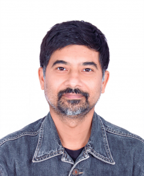
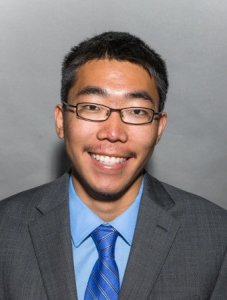
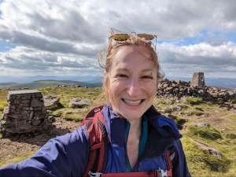
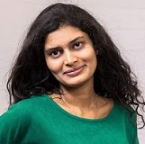
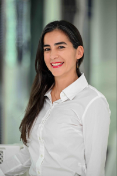
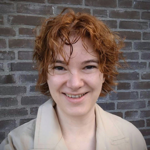

# —This workshop is over.—

Our main annual workshop will be co-located with EMNLP 2023 as a hybrid event on Zoom and in Singapore on December 6th. You can view our call for submissions [here](https://www.winlp.org/winlp-2023-workshop/winlp-2023-call-for-submissions/ "WiNLP 2022 – Call for Submissions"). The workshop is free and open to the general public. The in-person event will take place in Leo 1. The portions of the online event will take place on Zoom; to receive the link, please register for free on [Eventbrite](https://www.eventbrite.com/e/winlp-emnlp-2023-tickets-763200512277?aff=oddtdtcreator).

## Schedule

| Event | Tentative Time (in Singapore Standard Time \[GMT+8\]) |
| --- | --- |
| Virtual Poster Session (Gather.Town) | 8:30-9:30 |
| Welcome | 9:30-9:45 |
| Keynote: Dr. Monojit Choudhury | 9:45-10:30 |
| Coffee Break | 10:30-11:00 |
| Panel: Tackling Misinformation in Generative AI | 11:00-12:00 |
| Lunch (Aquarius 3 & 4) | 12:00-2:00 |
| Poster Session (East Foyer @ B2) | 2:00-3:30 |
| Coffee Break | 3:30-4:00 |
| Fireside Chat: Prof. Thamar Solorio Dr Jasmijn Bastings | 4:00-4:45 |
| Closing Session | 4:45-5:00 |

## Speakers

 

## Keynote

**Monojit Choudhury**

Dr. Monojit Choudhury is currently a Principal Applied Scientist at Microsoft Turing, and previously was a Principal researcher at Microsoft Research Lab India. His research interests span various aspects of natural language processing and cognitive sciences, including multilingual models, ethics of NLP, and AI and NLP for social good. Dr. Choudhury is a Prof of Practice at Plaksha University and an adjunct faculty at IIIT Hyderabad. He is the general chair of the Panini Linguistics Olympiad, which is the Indian national linguistics Olympiad for high school students and is actively involved with the International as well as Asia Pacific linguistics Olympiads. Dr. Choudhury has a PhD and BTech in Computer Science and Engineering from IIT Kharagpur.

## Panel: Tackling Misinformation in Generative AI

**Tiancheng Hu**

Tiancheng Hu is a 2nd-year PhD student at the University of Cambridge supervised by Prof. Nigel Collier. His research interest is at the intersection of natural language processing and computational social science. He is particularly interested in developing and applying methods to study human behavior, as well as responsible AI. 

**Seraphina Goldfarb Tarrant**

Seraphina Goldfarb-Tarrant is the Head of Safety at Cohere, where she works on both the practice and the theory of evaluating and mitigating harms from LLMs. She did her PhD under Adam Lopez in Fairness in Transfer Learning for NLP, at the Institute for Language, Cognition, and Computation (ILCC) in the Informatics department at the University of Edinburgh. She did her MSc in NLP, with a focus on Natural Language Generation, at the University of Washington under Fei Xia in collaboration with Nanyun Peng. Her research interests include the intersection of fairness with robustness and generalisation, cross-lingual transfer, and causal analysis. She had an industry career before her PhD, where she worked at Google in Tokyo, NYC, and Shanghai. She also spent two years as a sailor in the North Sea.

**Preethi Lahoti**

Preethi Lahoti is a Research Scientist at Google Research in its Responsible AI and Human Centered Technologies Organization, based in Zurich, Switzerland. Prior to this, she did her PhD in Computer Science (Machine Learning) at the Max Planck Institute for Informatics, Germany, where she was very advised by Prof. Gerhard Weikum and Prof. Krishna P. Gummadi. Her research focuses on enabling Responsible AI by developing new models and methods that detect, prevent and alleviate undesirable behaviors of ML by accounting for normative goals including fairness, robustness, trust and safety.

## Fireside Chat

**Thamar Solorio**

Solorio is a professor of Computer Science at MBZUAI and at the University of Houston (UH), she’s also the Director and founder of the RiTUAL Lab. She holds graduate degrees in computer science from the Instituto Nacional de Astrofísica, Óptica y Electrónica, in Puebla, Mexico. Solorio is a recipient of an NSF CAREER award, and of the 2014 Emerging Leader ABIE Award in Honor of Denice Denton. She is currently serving a second term as an elected board member of the North American Chapter of the Association of Computational Linguistics and was PC co-chair for NAACL 2019. She is co-Editor-in-Chief for the ACL Rolling Review (ARR) system and member of the ARR advisory board.

Jasmijn Bastings

Dr Jasmijn Bastings is a senior research scientist at Google DeepMind. They hold a PhD and MSc in artificial intelligence (AI) from the University of Amsterdam, and a BSc in AI with a minor in linguistics from Utrecht University. Jasmijn has worked on various topics within natural language processing, including automatic translation (e.g., Linguistically-informed NMT, Joey NMT) and interpretability (e.g., rationalizations, the Language Interpretability Tool), and has more recently been focusing on how to make language technology, in particular machine translation, more inclusive and gender fair.
